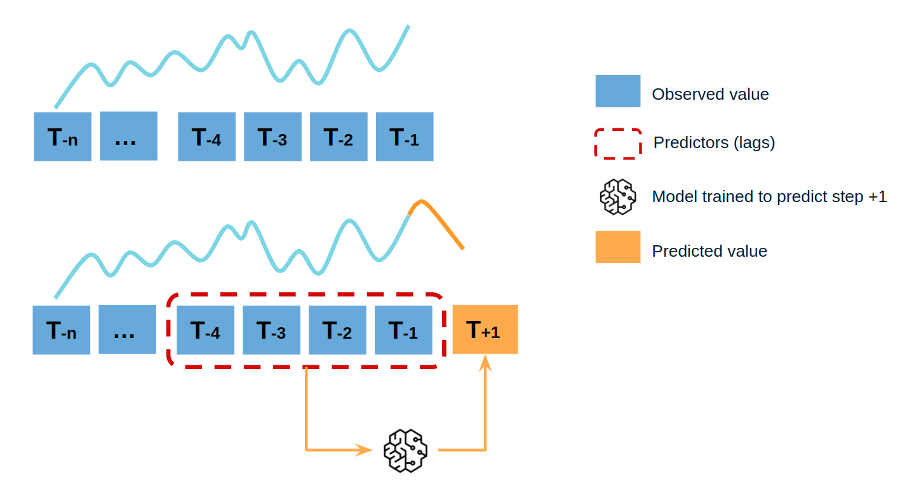
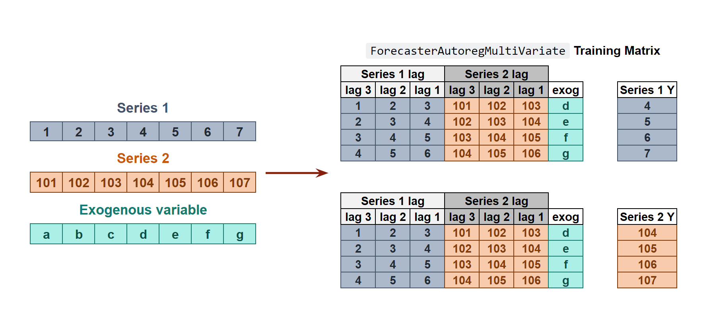

# Introduction to forecasting

## Time series and forecasting

A time series is a sequence of data arranged chronologically and spaced at equal or irregular intervals. The forecasting process consists of predicting the future value of a time series, either by modeling the series solely based on its past behavior (autoregressive) or by incorporating other external variables.

    

## Machine learning for forecasting

To apply machine learning models to forecasting problems, the time series needs to be transformed into a matrix where each value is associated with a specific time window (known as lags) that precedes it. In the context of time series, a lag with respect to a time step *t* is defined as the value of the series at previous time steps. For instance, lag 1 represents the value at time step *t-1*, while lag *m* represents the value at time step *t-m*.

This transformation is essential for machine learning models to capture the dependencies and patterns that exist between past and future values in a time series. By using lags as input features, machine learning models can learn from the past and make predictions about future values. The number of lags used as input features in the matrix is an important hyperparameter that needs to be carefully tuned to obtain the best performance of the model.

    
     
     <i>Time series transformation into a matrix of 5 lags and a vector with the value of the series that follows each row of the matrix.</i>

This type of transformation also allows to include additional variables.

    
     
     <i>Time series transformation including an exogenous variable.</i>

Once data have been rearranged into the new shape, any regression model can be trained to predict the next value (step) of the series. During model training, every row is considered a separate data instance, where values at lags 1, 2, ... *p* are considered predictors for the target quantity of the time series at time step *p+1*. 

    
     
     <i>Diagram of training a machine learning model with time series data.</i>

## Single-step forecasting

Single-step prediction is used when the goal is to predict only the next value of the series.

    
     
     <i>Diagram of single-step forecasting.</i>

## Multi-step forecasting

When working with time series, it is seldom needed to predict only the next element in the series (*t+1*). Instead, the most common goal is to predict a whole future interval (*t+1, ..., t+n*)  or a far point in time (*t+n*). Several strategies allow generating this type of prediction.

### Recursive multi-step forecasting

Since the value *t(n-1)* is required to predict *t(n)*, and *t(n-1)* is unknown, a recursive process is applied in which, each new prediction, is based on the previous one. This process is known as recursive forecasting or recursive multi-step forecasting and can be easily generated with the [`ForecasterAutoreg`](https://skforecast.org/latest/user_guides/autoregresive-forecaster.html) class.

    
     
     <i>Diagram of recursive multi-step forecasting.</i>

### Direct multi-step forecasting

Direct multi-step forecasting consists of training a different model for each step of the forecast horizon. For example, to predict the next 5 values of a time series, 5 different models are trained, one for each step. As a result, the predictions are independent of each other. This entire process is automated in the [`ForecasterAutoregDirect`](https://skforecast.org/latest/user_guides/direct-multi-step-forecasting.html) class. 

    
     
     <i>Diagram of direct multi-step forecasting.</i>

### Multiple output forecasting

Some machine learning models, such as long short-term memory (LSTM) neural network, can predict simultaneously several values of a sequence (*one-shot*). This strategy is not currently implemented in skforecast library.

## Global forecasting models

Univariate time series forecasting models a single time series as a linear or nonlinear combination of its lags, using past values of the series to predict its future. Global forecasting, involves building a single predictive model that considers all time series simultaneously. It attempts to capture the core patterns that govern the series, thereby mitigating the potential noise that each series might introduce. This approach is computationally efficient, easy to maintain, and can yield more robust generalizations across time series. There are two different strategies for global forecasting.

### Independent Multi-Series Forecasting

A single model is trained for all time series, but each time series remains independent of the others, meaning that past values of one series are not used as predictors of other series. However, modeling them together is useful because the series may follow the same intrinsic pattern regarding their past and future values. For instance, the sales of products A and B in the same store may not be related, but they follow the same dynamics, that of the store.

    
     
     <i>Transformation of two time series and an exogenous variable into the matrices needed to train a machine learning model in a multi-series context.</i>

To predict the next *n* steps, the strategy of [recursive multi-step forecasting](https://skforecast.org/latest/introduction-forecasting/introduction-forecasting.html#recursive-multi-step-forecasting) is applied

    
     
     <i>Diagram of recursive forecasting with multiple independent time series.</i>

The [`ForecasterAutoregMultiSeries`](https://skforecast.org/latest/user_guides/independent-multi-time-series-forecasting.html) and [`ForecasterAutoregMultiSeriesCustom`](https://skforecast.org/latest/user_guides/window-features-and-custom-features.html#forecasterautoregmultiseriescustom) classes cover this process. 

### Dependent Multi-Series Forecasting (multivariate time series)

All series are modeled together in a single model, considering that each time series depends not only on its past values but also on the past values of the other series. The forecaster is expected not only to learn the information of each series separately but also to relate them. An example is the measurements made by all the sensors (flow, temperature, pressure...) installed on an industrial machine such as a compressor.

    
     
     <i>Transformation of two time series and an exogenous variable into the matrices needed to train a machine learning model in a multi-variate-series context.</i>

The [`ForecasterAutoregMultiVariate`](https://skforecast.org/latest/user_guides/dependent-multi-series-multivariate-forecasting.html) class covers this process. 

## Forecasters

A **Forecaster** object in the skforecast library is a comprehensive container that provides essential functionality and methods for training a forecasting model and generating predictions for future points in time.

The **skforecast** library offers a variety of forecaster types, each tailored to specific requirements such as single or multiple time series, direct or recursive strategies, or custom predictors. Regardless of the specific forecaster type, all instances share the same API.

| Forecaster                   | Single series | Multiple series | Recursive strategy | Direct strategy | Probabilistic prediction | Time series differentiation | Exogenous features | Custom features |
|:-----------------------------|:-------------:|:---------------:|:------------------:|:---------------:|:------------------------:|:---------------------------:|:------------------:|:---------------:|
|[ForecasterAutoreg]           |✔️||✔️||✔️|✔️|✔️||
|[ForecasterAutoregDirect]     |✔️|||✔️|✔️||✔️||
|[ForecasterMultiSeries]       ||✔️|✔️||✔️|✔️|✔️||
|[ForecasterMultiSeriesCustom] ||✔️|✔️||✔️|✔️|✔️|✔️|
|[ForecasterMultiVariate]      ||✔️||✔️|✔️||✔️||
|[ForecasterRNN]               ||✔️||✔️|||||
|[ForecasterSarimax]           |✔️||✔️||✔️|✔️|✔️||

[ForecasterAutoreg]: https://skforecast.org/latest/user_guides/autoregresive-forecaster.html
[ForecasterAutoregDirect]: https://skforecast.org/latest/user_guides/direct-multi-step-forecasting.html
[ForecasterMultiSeries]: https://skforecast.org/latest/user_guides/independent-multi-time-series-forecasting.html
[ForecasterMultiSeriesCustom]: https://skforecast.org/latest/user_guides/window-features-and-custom-features.html#forecasterautoregmultiseriescustom
[ForecasterMultiVariate]: https://skforecast.org/latest/user_guides/dependent-multi-series-multivariate-forecasting.html
[ForecasterRNN]: https://skforecast.org/latest/user_guides/forecasting-with-deep-learning-rnn-lstm
[ForecasterSarimax]: https://skforecast.org/latest/user_guides/forecasting-sarimax-arima.html

To understand what can be done when initializing a forecaster with **skforecast** visit [Forecaster parameters](https://skforecast.org/latest/quick-start/forecaster-parameters) and [Forecaster attributes](https://skforecast.org/latest/quick-start/forecaster-attributes).

## Exogenous variables (features)

Exogenous variables are predictors that are independent of the model being used for forecasting, and their future values must be known in order to include them in the prediction process. The inclusion of exogenous variables can enhance the accuracy of forecasts.

In skforecast, exogenous variables [can be easily included](https://skforecast.org/latest/user_guides/exogenous-variables) as predictors in all forecasting models. To ensure that their effects are accurately accounted for, it is crucial to include these variables during both the training and prediction phases. This will help to optimize the accuracy of forecasts and provide more reliable predictions.

    
     
     <i>Time series transformation including an exogenous variable.</i>

## Backtesting forecasting models

In time series forecasting, the process of *backtesting* consists of evaluating the performance of a predictive model by applying it retrospectively to historical data. Therefore, it is a special type of cross-validation applied to the previous period(s).

The purpose of backtesting is to evaluate the accuracy and effectiveness of a model and identify any potential issues or areas of improvement. By testing the model on historical data, one can assess how well it performs on data that it has not seen before. This is an important step in the modeling process, as it helps to ensure that the model is robust and reliable.

Backtesting can be done using a variety of techniques, such as simple train-test splits or more sophisticated methods like rolling windows or expanding windows. The choice of method depends on the specific needs of the analysis and the characteristics of the time series data.

Overall, backtesting is an essential step in the development of a time series forecasting model. By rigorously testing the model on historical data, one can improve its accuracy and ensure that it is effective at predicting future values of the time series.

### Backtesting without refit

Backtesting without refit is a strategy where the model is trained only once and used sequentially without updating it, following the temporal order of the data. This approach is advantageous as it is much faster than other methods that require retraining the model each time. However, the model may lose its predictive power over time as it does not incorporate the latest information available.

 
 <i>Backtesting without refit.</i>

### Backtesting with refit and increasing training size (fixed origin)

In this approach, the model is trained before making predictions each time, and all available data up to that point is used in the training process. This differs from standard cross-validation, where the data is randomly distributed between training and validation sets.

Instead of randomizing the data, this backtesting sequentially increases the size of the training set while maintaining the temporal order of the data. By doing this, the model can be tested on progressively larger amounts of historical data, providing a more accurate assessment of its predictive capabilities.

 
 <i>Backtesting with refit and increasing training size (fixed origin).</i>

### Backtesting with refit and fixed training size (rolling origin)

In this approach, the model is trained using a fixed window of past observations, and the testing is performed on a rolling basis, where the training window is moved forward in time. The size of the training window is kept constant, allowing for the model to be tested on different sections of the data. This technique is particularly useful when there is a limited amount of data available, or when the data is non-stationary, and the model's performance may vary over time. Is also known as time series cross-validation or walk-forward validation.

 
 <i>Backtesting with refit and fixed training size (rolling origin).</i>

### Backtesting with intermittent refit

The model is retrained every *n* iterations, a method often used when the model retraining is limited to certain time intervals, such as weekly, but a different time window, such as a day, needs to be used for prediction.

This refit strategy can be implemented using either a fixed or rolling origin, providing flexibility in adapting the model to new data.

 
 <i>Backtesting with intermittent refit.</i>

### Backtesting including gap

This approach introduces a time gap between the training and test sets, replicating a scenario where predictions cannot be made immediately after the end of the training data.

For example, consider the goal of predicting the 24 hours of day D+1, but the predictions need to be made at 11:00 to allow sufficient flexibility. At 11:00 on day D, the task is to forecast hours [12 - 23] of the same day and hours [0 - 23] of day D+1. Thus, a total of 36 hours into the future must be predicted, with only the last 24 hours to be stored.

 
 <i>Backtesting with refit and gap.</i>

### Which strategy should I use?

To ensure an accurate evaluation of your model and gain confidence in its predictive performance on new data, it is critical to employ an appropriate backtesting strategy.

To determine an appropriate strategy, factors such as use case characteristics, available computing resources, and time intervals between predictions must be considered. These factors determine when the model should be refitted and the prediction horizon that should be used.

+ **Prediction horizon**: Suppose you need to predict the users of an App every Monday for the entire week. In this case, each iteration would be a seven-step prediction representing the seven days of the week.
  
+ **Refit strategy**: Continuing with the example above, at the end of the week you need to decide whether or not to update the model. Training the model with additional data can improve its predictive ability, but it requires more time and computational resources, which may not always be readily available. A reasonable approach is to retrain the model when the error metric shows a consistent upward trend. This behavior can be effectively simulated using the backtesting framework.

As an example, backtesting is performed using the data from this [skforecast example](https://www.cienciadedatos.net/documentos/py29-forecasting-electricity-power-demand-python.html). The same backtest is run with different `refit` strategies: `False` (no refit between predictions), refit every `30` days, every `14` days, every `7` days and `True` (refit after every predictions). Notice that the significant increase in time does not correspond to a decrease in error.

| refit value | execution time (s) | metric |
|------------:|-------------------:|-------:|
|       False |                1.4 |  262.5 |
|          30 |                4.0 |  263.4 |
|          14 |                6.3 |  262.5 |
|           7 |               11.1 |  261.4 |
|        True |               69.1 |  258.3 |

For a code example illustrating the backtesting process, refer to the [Backtesting user guide](https://skforecast.org/latest/user_guides/backtesting.html).