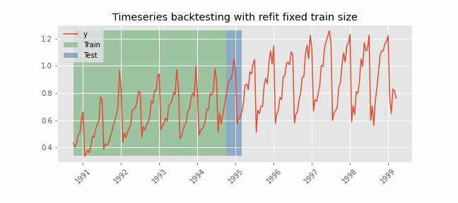

# Introduction to forecasting

## Time series and forecasting

A time series is a sequence of data arranged chronologically and spaced at equal or irregular intervals. The forecasting process consists of predicting the future value of a time series, either by modeling the series solely based on its past behavior (autoregressive) or by incorporating other external variables.

## Machine learning for forecasting

To apply machine learning models to forecasting problems, the time series needs to be transformed into a matrix where each value is associated with a specific time window (known as lags) that precedes it. In the context of time series, a lag with respect to a time step *t* is defined as the value of the series at previous time steps. For instance, lag 1 represents the value at time step *t-1*, while lag *m* represents the value at time step *t-m*.

This transformation is essential for machine learning models to capture the dependencies and patterns that exist between past and future values in a time series. By using lags as input features, machine learning models can learn from the past and make predictions about future values. The number of lags used as input features in the matrix is an important hyperparameter that needs to be carefully tuned to obtain the best performance of the model.

 <i>Time series transformation into a matrix of 5 lags and a vector with the value of the series that follows each row of the matrix.</i>

This type of transformation also allows to include additional variables.

 <i>Time series transformation including an exogenous variable.</i>

Once data have been rearranged into the new shape, any regression model can be trained to predict the next value (step) of the series. During model training, every row is considered a separate data instance, where values at lags 1, 2, ... *p* are considered predictors for the target quantity of the time series at time step *p+1*. 

 <i>Diagram of training a machine learning model with time series data.</i>

## Single-step forecasting

Single-step prediction is used when the goal is to predict only the next value of the series.

 <i>Diagram of single-step forecasting.</i>

## Multi-step forecasting

When working with time series, it is seldom needed to predict only the next element in the series (*t+1*). Instead, the most common goal is to predict a whole future interval (*t+1, ..., t+n*)  or a far point in time (*t+n*). Several strategies allow generating this type of prediction.

### Recursive multi-step forecasting

Since the value *t(n-1)* is required to predict *t(n)*, and *t(n-1)* is unknown, a recursive process is applied in which, each new prediction, is based on the previous one. This process is known as recursive forecasting or recursive multi-step forecasting and can be easily generated with the `ForecasterAutoreg` and `ForecasterAutoregCustom` classes.

 <i>Diagram of recursive multi-step forecasting.</i>

### Direct multi-step forecasting

Direct multi-step forecasting consists of training a different model for each step of the forecast horizon. For example, to predict the next 5 values of a time series, 5 different models are trained, one for each step. As a result, the predictions are independent of each other. This entire process is automated in the `ForecasterAutoregDirect` class. 

 <i>Diagram of direct multi-step forecasting.</i>

### Multiple output forecasting

Some machine learning models, such as long short-term memory (LSTM) neural network, can predict simultaneously several values of a sequence (*one-shot*). This strategy is not currently implemented in skforecast library.

## Multi-time series forecasting

In univariate time series forecasting, a single time series is modeled as a linear or nonlinear combination of its lags, where past values of the series are used to forecast its future. In multi-series forecasting, two or more time series are modeled together using a single model. There are two distinct strategies for multi-series forecasting.

### Independent Multi-Series Forecasting

A single model is trained for all time series, but each time series remains independent of the others, meaning that past values of one series are not used as predictors of other series. However, modeling them together is useful because the series may follow the same intrinsic pattern regarding their past and future values. For instance, the sales of products A and B in the same store may not be related, but they follow the same dynamics, that of the store.

 <i>Transformation of two time series and an exogenous variable into the matrices needed to train a machine learning model in a multi-series context.</i>

To predict the next *n* steps, the strategy of [recursive multi-step forecasting](https://joaquinamatrodrigo.github.io/skforecast/latest/quick-start/introduction-forecasting.html#multi-step-forecasting) is applied

 <i>Diagram of recursive forecasting with multiple independent time series.</i>

### Dependent Multi-Series Forecasting (multivariate time series)

All series are modeled together in a single model, considering that each time series depends not only on its past values but also on the past values of the other series. The forecaster is expected not only to learn the information of each series separately but also to relate them. An example is the measurements made by all the sensors (flow, temperature, pressure...) installed on an industrial machine such as a compressor.

 <i>Transformation of two time series and an exogenous variable into the matrices needed to train a machine learning model in a multi-variate-series context.</i>

## Backtesting forecasting models

In time series forecasting, backtesting refers to the process of validating a predictive model using historical data. The technique involves moving backwards in time, step-by-step, to assess how well a model would have performed if it had been used to make predictions during that time period. Backtesting is a form of cross-validation that is applied to previous periods in the time series.

The purpose of backtesting is to evaluate the accuracy and effectiveness of a model and identify any potential issues or areas of improvement. By testing the model on historical data, one can assess how well it performs on data that it has not seen before. This is an important step in the modeling process, as it helps to ensure that the model is robust and reliable.

Backtesting can be done using a variety of techniques, such as simple train-test splits or more sophisticated methods like rolling windows or expanding windows. The choice of method depends on the specific needs of the analysis and the characteristics of the time series data.

Overall, backtesting is an essential step in the development of a time series forecasting model. By rigorously testing the model on historical data, one can improve its accuracy and ensure that it is effective at predicting future values of the time series.

### Backtesting with refit and increasing training size (fixed origin)

In this approach, the model is trained before making predictions each time, and all available data up to that point is used in the training process. This differs from standard cross-validation, where the data is randomly distributed between training and validation sets.

Instead of randomizing the data, this backtesting sequentially increases the size of the training set while maintaining the temporal order of the data. By doing this, the model can be tested on progressively larger amounts of historical data, providing a more accurate assessment of its predictive capabilities.

 <i>Backtesting with refit and increasing training size (fixed origin).</i>

### Backtesting with refit and fixed training size (rolling origin)

In this approach, the model is trained using a fixed window of past observations, and the testing is performed on a rolling basis, where the training window is moved forward in time. The size of the training window is kept constant, allowing for the model to be tested on different sections of the data. This technique is particularly useful when there is a limited amount of data available, or when the data is non-stationary, and the model's performance may vary over time. Is also known as time series cross-validation or walk-forward validation.

 <i>Backtesting with refit and fixed training size (rolling origin).</i>

### Backtesting without refit

Backtesting without refit is a strategy where the model is trained only once and used sequentially without updating it, following the temporal order of the data. This approach is advantageous as it is much faster than other methods that require retraining the model each time. However, the model may lose its predictive power over time as it does not incorporate the latest information available.

 <i>Backtesting without refit.</i>
