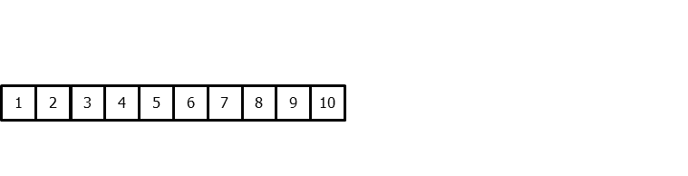

# Understanding the forecaster parameters

Understanding what can be done when initializing a forecaster with skforecast can have a significant impact on the accuracy and effectiveness of the model. This guide highlights key considerations to keep in mind when initializing a forecaster and how these functionalities can be used to create more powerful and accurate forecasting models in Python.

We will explore the arguments that can be included in a `ForecasterAutoreg`, but this can be extrapolated to any of the skforecast forecasters.

```python
# Create a forecaster
# ==============================================================================
from skforecast.ForecasterAutoreg import ForecasterAutoreg
from sklearn.ensemble import RandomForestRegressor

forecaster = ForecasterAutoreg(
                 regressor        = None,
                 lags             = None,
                 transformer_y    = None,
                 transformer_exog = None,
                 weight_func      = None,
                 fit_kwargs       = None,
                 forecaster_id    = None
             )
```

!!! tip

    To be able to create and train a forecaster, at least `regressor` and `lags` must be specified.


## Regressor

Skforecast is a Python library that facilitates using scikit-learn regressors as multi-step forecasters and also works with any regressor compatible with the scikit-learn API. Therefore, any of these regressors can be used to create a forecaster:

+ [HistGradientBoostingRegressor](https://scikit-learn.org/stable/modules/generated/sklearn.ensemble.HistGradientBoostingRegressor.html)

+ [LGBMRegressor](https://lightgbm.readthedocs.io/en/latest/pythonapi/lightgbm.LGBMRegressor.html)

+ [XGBoost](https://xgboost.readthedocs.io/en/stable/python/python_api.html#module-xgboost.sklearn)

+ [CatBoost](https://catboost.ai/en/docs/concepts/python-reference_catboostregressor)

```python
# Create a forecaster
# ==============================================================================
from skforecast.ForecasterAutoreg import ForecasterAutoreg
from sklearn.ensemble import RandomForestRegressor

forecaster = ForecasterAutoreg(
                 regressor = RandomForestRegressor(),
                 lags      = None
             )
```


## Lags

To apply machine learning models to forecasting problems, the time series needs to be transformed into a matrix where each value is associated with a specific time window (known as lags) that precedes it. In the context of time series, a lag with respect to a time step *t* is defined as the value of the series at previous time steps. For instance, lag 1 represents the value at time step *t-1*, while lag *m* represents the value at time step *t-m*.

This transformation is essential for machine learning models to capture the dependencies and patterns that exist between past and future values in a time series. By using lags as input features, machine learning models can learn from the past and make predictions about future values. The number of lags used as input features in the matrix is an important hyperparameter that needs to be carefully tuned to obtain the best performance of the model.

<p align="center"></p>

<center><font size="2.5"> <i>Time series transformation into a matrix of 5 lags and a vector with the value of the series that follows each row of the matrix.</i></font></center>
<br>


```python
# Create a forecaster
# ==============================================================================
from skforecast.ForecasterAutoreg import ForecasterAutoreg
from sklearn.ensemble import RandomForestRegressor

forecaster = ForecasterAutoreg(
                 regressor = RandomForestRegressor(),
                 lags      = 5
             )
```


## Transformers

Skforecast has two arguments in all the forecasters that allow more detailed control over input data transformations. This feature is particularly useful as many machine learning models require specific data pre-processing transformations. For example, linear models may benefit from features being scaled, or categorical features being transformed into numerical values.

Both arguments expect an instance of a transformer (preprocessor) compatible with the scikit-learn preprocessing API with the methods: fit, transform, fit_transform and, inverse_transform.

More information: [Scikit-learn transformers and pipelines](https://skforecast.org/latest/user_guides/sklearn-transformers-and-pipeline.html).

!!! example

    In this example, a scikit-learn `StandardScaler` preprocessor is used for both the time series and the exogenous variables.

```python
# Create a forecaster
# ==============================================================================
from skforecast.ForecasterAutoreg import ForecasterAutoreg
from sklearn.ensemble import RandomForestRegressor
from sklearn.preprocessing import StandardScaler

forecaster = ForecasterAutoreg(
                 regressor        = RandomForestRegressor(),
                 lags             = 5,
                 transformer_y    = StandardScaler(),
                 transformer_exog = StandardScaler()
             )
```


## Weighted time series forecasting

The presence of unreliable or unrepresentative values in the data history poses a significant challenge, as it hinders model learning. However, most forecasting algorithms require complete time series data, making it impossible to remove these observations. An alternative solution is to reduce the weight of the affected observations during model training. **Skforecast** facilitates the control of data weights with the `weight_func` argument.

More information: [Weighted time series forecasting](https://skforecast.org/latest/user_guides/weighted-time-series-forecasting.html).

!!! example

    The following example shows how a part of the time series can be excluded from the model training by assigning it a weight of zero using the `custom_weights` function, depending on the index.

```python
# Create a forecaster
# ==============================================================================
from skforecast.ForecasterAutoreg import ForecasterAutoreg
from sklearn.ensemble import RandomForestRegressor
from sklearn.preprocessing import StandardScaler

# Custom function to create weights
# ==============================================================================
def custom_weights(index):
    """
    Return 0 if index is between 2012-06-01 and 2012-10-21.
    """
    weights = np.where(
                  (index >= '2012-06-01') & (index <= '2012-10-21'),
                   0,
                   1
              )

    return weights

forecaster = ForecasterAutoreg(
                 regressor        = RandomForestRegressor(),
                 lags             = 5,
                 transformer_y    = None,
                 transformer_exog = None,
                 weight_func      = custom_weights,
             )
```


## Inclusion of kwargs in the regressor fit method

Some regressors include the possibility to add some additional configuration during the fitting method. The predictor parameter `fit_kwargs` allows these arguments to be set when the forecaster is declared.

!!! danger

    To add weights to the forecaster, it must be done through the `weight_func` argument and not through a `fit_kwargs`.

!!! example

    The following example demonstrates the inclusion of categorical features in an LGBM regressor. This must be done during the `LGBMRegressor` fit method. [Fit parameters lightgbm](https://lightgbm.readthedocs.io/en/latest/pythonapi/lightgbm.LGBMRegressor.html#lightgbm.LGBMRegressor.fit)

More information: [Categorical features](https://skforecast.org/latest/user_guides/categorical-features.html#native-implementation-for-categorical-features).

```python
# Create a forecaster
# ==============================================================================
from skforecast.ForecasterAutoreg import ForecasterAutoreg
from lightgbm import LGBMRegressor

forecaster = ForecasterAutoreg(
                 regressor        = LGBMRegressor(),
                 lags             = 5,
                 transformer_y    = None,
                 transformer_exog = None,
                 weight_func      = None,
                 fit_kwargs       = {'categorical_feature': ['exog_1', 'exog_2']}
             )
```


## Forecaster ID

Name used as an identifier of the forecaster. It may be used, for example to identify the time series being modeled.

```python
# Create a forecaster
# ==============================================================================
from skforecast.ForecasterAutoreg import ForecasterAutoreg
from sklearn.ensemble import RandomForestRegressor

forecaster = ForecasterAutoreg(
                 regressor        = RandomForestRegressor(),
                 lags             = 5,
                 transformer_y    = None,
                 transformer_exog = None,
                 weight_func      = None,
                 fit_kwargs       = None,
                 forecaster_id    = 'my_forecaster'
             )
```