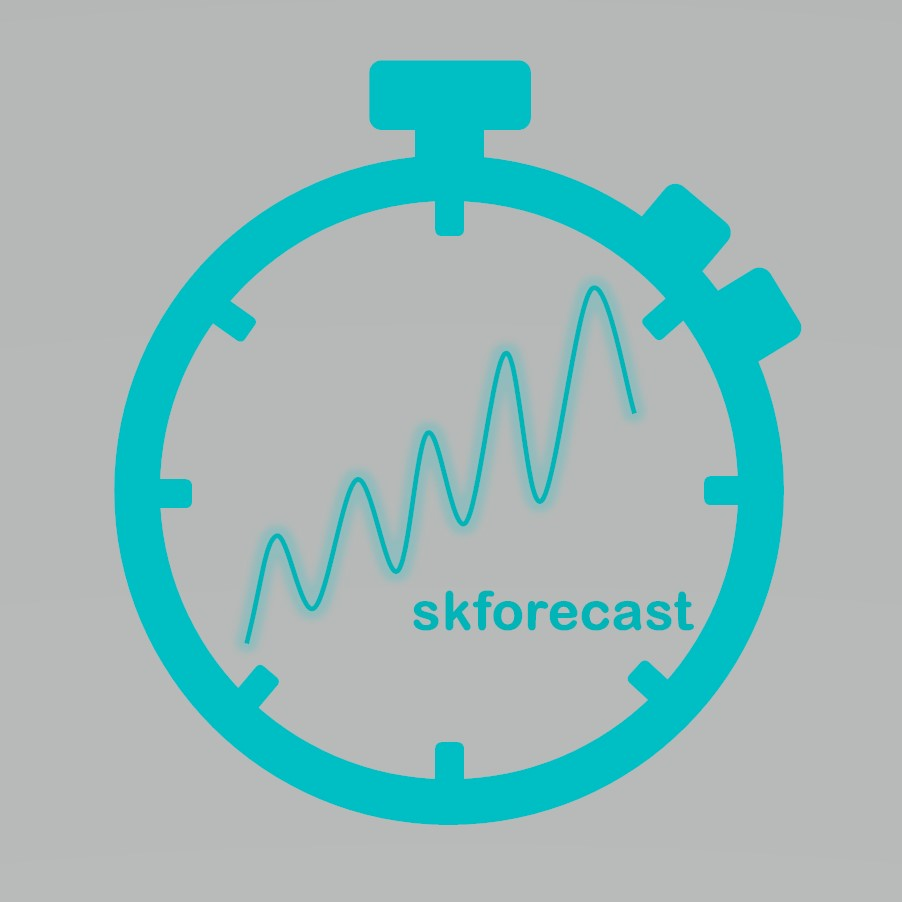

[](https://codecov.io/gh/JoaquinAmatRodrigo/skforecast)
[](https://github.com/JoaquinAmatRodrigo/skforecast/actions/workflows/unit-tests.yml/badge.svg)
[](https://GitHub.com/Naereen/StrapDown.js/graphs/commit-activity)

[](https://pepy.tech/project/skforecast)


# skforecast

<p></p>

**Time series forecasting with scikit-learn regressors.**

**Skforecast** is a python library that eases using scikit-learn regressors as multi-step forecasters. It also works with any regressor compatible with the scikit-learn API (pipelines, CatBoost, LightGBM, XGBoost, Ranger...).

**Documentation: https://joaquinamatrodrigo.github.io/skforecast/**


# Installation

The default installation of skforecast only installs hard dependencies.

```bash
pip install skforecast
```

Specific version:

```bash
pip install skforecast==0.6.0
```

Latest (unstable):

```bash
pip install git+https://github.com/JoaquinAmatRodrigo/skforecast#master
```

Install the full version (all dependencies):

```bash
pip install skforecast[full]
```

Install optional dependencies:

```bash
pip install skforecast[statsmodels]
```

```bash
pip install skforecast[plotting]
```

# Dependencies

## Hard dependencies

+ numpy>=1.20, <1.24
+ pandas>=1.2, <1.6
+ tqdm>=4.57.0, <4.65
+ scikit-learn>=1.0, <1.2
+ optuna>=2.10.0, <3.1
+ scikit-optimize==0.9.0
+ joblib>=1.1.0, <1.3.0

## Optional dependencies

+ matplotlib>=3.3, <3.7
+ seaborn==0.11
+ statsmodels>=0.12, <0.14

# Features

+ Create recursive autoregressive forecasters from any regressor that follows the scikit-learn API
+ Create direct autoregressive forecasters from any regressor that follows the scikit-learn API
+ Create multi-series autoregressive forecasters from any regressor that follows the scikit-learn API
+ Include exogenous variables as predictors
+ Include custom predictors (rolling mean, rolling variance ...)
+ Multiple backtesting methods for model validation
+ Grid search, random search and bayesian search to find optimal lags (predictors) and best hyperparameters
+ Include custom metrics for model validation and grid search
+ Prediction interval estimated by bootstrapping and quantile regression
+ Get predictor importance
+ Forecaster in production

## What is coming in the new release?

- [] Predict the distribution of each predicted step.
- [] A class of its own and faster implementation of ARIMA models with [pmdarima](https://github.com/alkaline-ml/pmdarima), `ForecasterSarimax`. 
- [] Bug fixes and performance improvements.

Try it:
```bash
pip install git+https://github.com/JoaquinAmatRodrigo/skforecast@0.7.x
```

Visit the [changelog](https://github.com/JoaquinAmatRodrigo/skforecast/blob/0.7.x/changelog.md) to view all notable changes.


# Documentation

The documentation for the latest release is at [skforecast docs](https://joaquinamatrodrigo.github.io/skforecast/).

Recent improvements are highlighted in the [release notes](https://joaquinamatrodrigo.github.io/skforecast/latest/releases/releases.html).

+ [Introduction to time series and forecasting](https://joaquinamatrodrigo.github.io/skforecast/latest/quick-start/introduction-forecasting.html)

+ [Recursive multi-step forecasting](https://joaquinamatrodrigo.github.io/skforecast/latest/user_guides/autoregresive-forecaster.html)

+ [Multi-time series forecasting](https://joaquinamatrodrigo.github.io/skforecast/latest/user_guides/multi-time-series-forecasting.html)

+ [Multivariate forecasting](https://joaquinamatrodrigo.github.io/skforecast/latest/user_guides/multivariate-forecasting.html)

+ [Backtesting (validation) of forecasting models](https://joaquinamatrodrigo.github.io/skforecast/latest/user_guides/backtesting.html)

+ [Hyperparameter tuning and lags selection of forecasting models](https://joaquinamatrodrigo.github.io/skforecast/latest/user_guides/hyperparameter-tuning-and-lags-selection.html)

+ [Prediction intervals](https://joaquinamatrodrigo.github.io/skforecast/latest/user_guides/prediction-intervals.html)

+ [Using forecasters in production](https://joaquinamatrodrigo.github.io/skforecast/latest/user_guides/forecaster-in-production.html)


# Examples and tutorials 

**English**

+ [**Skforecast: time series forecasting with Python and Scikit-learn**](https://www.cienciadedatos.net/documentos/py27-time-series-forecasting-python-scikitlearn.html)      [](https://mybinder.org/v2/gh/JoaquinAmatRodrigo/skforecast/master?labpath=examples%2Ftime-series-forecasting-python-scikitlearn.ipynb)

+ [**Forecasting electricity demand with Python**](https://www.cienciadedatos.net/documentos/py29-forecasting-electricity-power-demand-python.html)  [](https://mybinder.org/v2/gh/JoaquinAmatRodrigo/skforecast/master?labpath=examples%2Fforecasting-electricity-power-demand-python.ipynb)

+ [**Forecasting web traffic with machine learning and Python**](https://www.cienciadedatos.net/documentos/py37-forecasting-web-traffic-machine-learning.html)  [](https://mybinder.org/v2/gh/JoaquinAmatRodrigo/skforecast/master?labpath=examples%2Fforecasting-web-traffic-machine-learning.ipynb)

+ [**Forecasting time series with gradient boosting: Skforecast, XGBoost, LightGBM and CatBoost**](https://www.cienciadedatos.net/documentos/py39-forecasting-time-series-with-skforecast-xgboost-lightgbm-catboost.html) [](https://mybinder.org/v2/gh/JoaquinAmatRodrigo/skforecast/master?labpath=examples%2Fforecasting-time-series-with-skforecast-xgboost-lightgbm-catboost.ipynb)

+ [**Bitcoin price prediction with Python**](https://www.cienciadedatos.net/documentos/py41-forecasting-cryptocurrency-bitcoin-machine-learning-python.html) [](https://mybinder.org/v2/gh/JoaquinAmatRodrigo/skforecast/master?labpath=examples%2Fforecasting-cryptocurrency-bitcoin-machine-learning-python.ipynb) 

+ [**Prediction intervals in forecasting models**](https://www.cienciadedatos.net/documentos/py42-forecasting-prediction-intervals-machine-learning.html) [](https://mybinder.org/v2/gh/JoaquinAmatRodrigo/skforecast/master?labpath=examples%2Fforecasting-prediction-intervals-machine-learning.ipynb)

+ [**Multi-series forecasting**](https://www.cienciadedatos.net/documentos/py44-multi-series-forecasting-skforecast.html) [](https://mybinder.org/v2/gh/JoaquinAmatRodrigo/skforecast/master?labpath=examples%2Fmulti-series-forecasting.ipynb)

+ [**Reducing the influence of Covid-19 on time series forecasting models**](https://www.cienciadedatos.net/documentos/py45-weighted-time-series-forecasting.html)


**Español**

+ [**Skforecast: forecasting series temporales con Python y Scikit-learn**](https://www.cienciadedatos.net/documentos/py27-forecasting-series-temporales-python-scikitlearn.html)      [](https://mybinder.org/v2/gh/JoaquinAmatRodrigo/skforecast/master?labpath=examples%2Fforecasting-series-temporales-python-scikitlearn.ipynb)

+ [**Forecasting de la demanda eléctrica**](https://www.cienciadedatos.net/documentos/py29-forecasting-demanda-energia-electrica-python.html)      [](https://mybinder.org/v2/gh/JoaquinAmatRodrigo/skforecast/master?labpath=examples%2Fforecasting-demanda-energia-electrica-python.ipynb)

+ [**Forecasting de las visitas a una página web**](https://www.cienciadedatos.net/documentos/py37-forecasting-visitas-web-machine-learning.html)      [](https://mybinder.org/v2/gh/JoaquinAmatRodrigo/skforecast/master?labpath=examples%2Fforecasting-visitas-web-machine-learning.ipynb)

+ [**Forecasting series temporales con gradient boosting: Skforecast, XGBoost, LightGBM y CatBoost**](https://www.cienciadedatos.net/documentos/py39-forecasting-series-temporales-con-skforecast-xgboost-lightgbm-catboost.html)      [](https://mybinder.org/v2/gh/JoaquinAmatRodrigo/skforecast/master?labpath=examples%2Fforecasting-series-temporales-con-skforecast-xgboost-lightgbm-catboost.ipynb)

+ [**Predicción del precio de Bitcoin con Python**](https://www.cienciadedatos.net/documentos/py41-forecasting-criptomoneda-bitcoin-machine-learning-python.html)      [](https://mybinder.org/v2/gh/JoaquinAmatRodrigo/skforecast/master?labpath=examples%2Fforecasting-criptomoneda-bitcoin-machine-learning-python.ipynb)

+ [**Workshop predicción de series temporales con machine learning Universidad de Deusto / Deustuko Unibertsitatea**](https://youtu.be/MlktVhReO0E)

+ [**Intervalos de predicción en modelos de forecasting**](https://www.cienciadedatos.net/documentos/py42-intervalos-prediccion-modelos-forecasting-machine-learning.html)      [](https://mybinder.org/v2/gh/JoaquinAmatRodrigo/skforecast/master?labpath=examples%2Fintervalos-prediccion-modelos-forecasting-machine-learning.ipynb)

+ [**Multi-series forecasting**](https://www.cienciadedatos.net/documentos/py44-multi-series-forecasting-skforecast-español.html)   [](https://mybinder.org/v2/gh/JoaquinAmatRodrigo/skforecast/master?labpath=examples%2Fmulti-series-forecasting-español.ipynb)


# Donating

If you found skforecast useful, you can support us with a donation. Your contribution will help to continue developing and improving this project. Many thanks!

[](https://www.paypal.com/donate/?hosted_button_id=D2JZSWRLTZDL6)


# Citation

If you use this software, please cite it using the following metadata.

**APA**:
```
Amat Rodrigo, J., & Escobar Ortiz, J. skforecast (Version 0.6.0) [Computer software]
```

**BibTeX**:
```
@software{skforecast,
author = {Amat Rodrigo, Joaquin and Escobar Ortiz, Javier},
license = {MIT},
month = {11},
title = {{skforecast}},
version = {0.6.0},
year = {2022}
}
```

View the [citation file](https://github.com/JoaquinAmatRodrigo/skforecast/blob/master/CITATION.cff).


# License

**joaquinAmatRodrigo/skforecast** is licensed under the **MIT License**, a short and simple permissive license with conditions only requiring the preservation of copyright and license notices. Licensed works, modifications and larger works may be distributed under different terms and without source code.