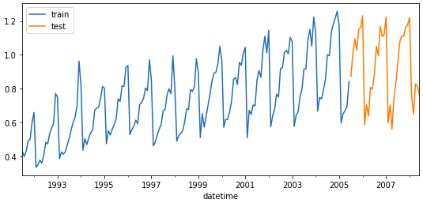
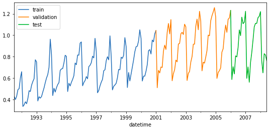

[](https://GitHub.com/Naereen/StrapDown.js/graphs/commit-activity)


[](https://pepy.tech/project/skforecast)


# skforecast

<p></p>

**Time series forecasting with scikit-learn regressors.**

**Skforecast** is a python library that eases using scikit-learn regressors as multi-step forecasters. It also works with any regressor compatible with the scikit-learn API (pipelines, CatBoost, LightGBM, XGBoost, Ranger...).

**Documentation: https://joaquinamatrodrigo.github.io/skforecast/**

**Version 0.4** has undergone a huge code refactoring. Main changes are related to input-output formats (only pandas series and dataframes are allowed although internally numpy arrays are used for performance) and model validation methods (unified into backtesting with and without refit). [Changelog](./changelog.md)


## Table of contents

+ [Installation](#installation)
+ [Dependencies](#dependencies)
+ [Features](#features)
+ [Introduction](#introduction)
+ [Examples](#examples)
  + [Autoregressive forecaster](#autoregressive-forecaster)
  + [Autoregressive forecaster with exogenous predictors](#autoregressive-forecaster-with-exogenous-predictors)
  + [Autoregressive forecaster with custom predictors](#autoregressive-forecaster-with-custom-predictors)
  + [Backtesting](#backtesting)
  + [Model tuning](#model-tuning)
+ [Tutorials](#tutorials)

## Installation

```bash
pip install skforecast
```

Specific version:

```bash
pip install skforecast==0.3
```

Latest (unstable):

```bash
pip install git+https://github.com/JoaquinAmatRodrigo/skforecast#master
```

The most common error when importing the library is:

 `'cannot import name 'mean_absolute_percentage_error' from 'sklearn.metrics'`.
 
 This is because the scikit-learn installation is lower than 0.24. Try to upgrade scikit-learn with
 
 ```bash
pip3 install -U scikit-learn
```

## Dependencies

+ python>=3.7.1
+ numpy>=1.20.1
+ pandas>=1.2.2
+ tqdm>=4.57.0
+ scikit-learn>=1.0.1
+ statsmodels>=0.12.2

## Features

+ Create recursive autoregressive forecasters from any scikit-learn regressor
+ Create multi-output autoregressive forecasters from any scikit-learn regressor
+ Grid search to find optimal hyperparameters
+ Grid search to find optimal lags (predictors)
+ Include exogenous variables as predictors
+ Include custom predictors (rolling mean, rolling variance ...)
+ Backtesting
+ Prediction interval estimated by bootstrapping
+ Get predictor importance


## Introduction


A time series is a sequence of data arranged chronologically, in principle, equally spaced in time. Time series forecasting is the use of a model to predict future values based on previously observed values, with the option of also including other external variables.

When working with time series, it is seldom needed to predict only the next element in the series (*t+1*). Instead, the most common goal is to predict a whole future interval (*t+1, ..., t+n*)  or a far point in time (*t+n*). There are several strategies that allow generating this type of multiple predictions.
<br>

**Recursive multi-step forecasting**

Since the value of *t(n)* is required to predict the point *t(n-1)*, and *t(n-1)* is unknown, it is necessary to make recursive predictions in which, each new prediction, is based on the previous one. This process is known as recursive forecasting or recursive multi-step forecasting.

<p></p>

<br>

The main challenge when using scikit-learn models for recursive multi-step forecasting is transforming the time series in an matrix where, each value of the series, is related to the time window (lags) that precedes it. This forecasting strategy can be easily generated with the classes `ForecasterAutoreg` and `ForecasterAutoregCustom`.

<p></p>

<center><font size="2.5"> <i>Time series  transformation into a matrix of 5 lags and a vector with the value of the series that follows each row of the matrix.</i></font></center>


<p></p>

<center><font size="2.5"> <i>Time series transformation including an exogenous variable.</i></font></center>

<br><br>

**Direct multi-step forecasting**

This strategy consists of training a different model for each step. For example, to predict the next 5 values of a time series, 5 different models are trainded, one for each step. As a result, the predictions are independent of each other. This forecasting strategy can be easily generated with the `ForecasterAutoregMultiOutput` class (changed in version 0.1.9).

<p></p>

<center><font size="2.5"> <i>Time series transformation into the matrices needed to train a direct multi-step forecaster.</i></font></center>
<br><br>

**Multiple output forecasting**

Certain models are capable of simultaneously predicting several values of a sequence (one-shot), for example, LSTM neural networks. This strategy is not implemented in skforecast.

<br><br>

## Examples

### Autoregressive forecaster

```python
# Libraries
# ==============================================================================
import numpy as np
import pandas as pd
import matplotlib.pyplot as plt
from skforecast.ForecasterAutoreg import ForecasterAutoreg
from sklearn.ensemble import RandomForestRegressor
from sklearn.metrics import mean_squared_error
```

```python
# Download data
# ==============================================================================
url = ('https://raw.githubusercontent.com/JoaquinAmatRodrigo/skforecast/master/data/h2o.csv')
data = pd.read_csv(url, sep=',', header=0, names=['y', 'datetime'])

# Data preprocessing
# ==============================================================================
data['datetime'] = pd.to_datetime(data['datetime'], format='%Y/%m/%d')
data = data.set_index('datetime')
data = data.asfreq('MS')
data = data['y']
data = data.sort_index()

# Split train-test
# ==============================================================================
steps = 36
data_train = data[:-steps]
data_test  = data[-steps:]

# Plot
# ==============================================================================
fig, ax = plt.subplots(figsize=(9, 4))
data_train.plot(ax=ax, label='train')
data_test.plot(ax=ax, label='test')
ax.legend()
```

<p></p>

``` python
# Create and fit forecaster
# ==============================================================================
forecaster = ForecasterAutoreg(
                regressor = RandomForestRegressor(random_state=123),
                lags      = 15
             )

forecaster.fit(y=data_train)
forecaster
```

```
================= 
ForecasterAutoreg 
================= 
Regressor: RandomForestRegressor(random_state=123) 
Lags: [ 1  2  3  4  5  6  7  8  9 10 11 12 13 14 15] 
Window size: 15 
Included exogenous: False 
Type of exogenous variable: None 
Exogenous variables names: None 
Training range: [Timestamp('1991-07-01 00:00:00'), Timestamp('2005-06-01 00:00:00')] 
Training index type: DatetimeIndex 
Training index frequency: MS 
Regressor parameters: {'bootstrap': True, 'ccp_alpha': 0.0, 'criterion': 'squared_error', 'max_depth': None, 'max_features': 'auto', 'max_leaf_nodes': None, 'max_samples': None, 'min_impurity_decrease': 0.0, 'min_samples_leaf': 1, 'min_samples_split': 2, 'min_weight_fraction_leaf': 0.0, 'n_estimators': 100, 'n_jobs': None, 'oob_score': False, 'random_state': 123, 'verbose': 0, 'warm_start': False} 
Creation date: 2021-12-08 18:21:27 
Last fit date: 2021-12-08 18:21:27 
Skforecast version: 0.4.0
```

``` python
# Predict
# ==============================================================================
predictions = forecaster.predict(steps=36)
predictions.head(3)
```

```
2005-07-01    0.921840
2005-08-01    0.954921
2005-09-01    1.101716
Freq: MS, Name: pred, dtype: float64
```

``` python
# Plot predictions
# ==============================================================================
fig, ax=plt.subplots(figsize=(9, 4))
data_train.plot(ax=ax, label='train')
data_test.plot(ax=ax, label='test')
predictions.plot(ax=ax, label='predictions')
ax.legend()
```

<p></p>

``` python
# Prediction error
# ==============================================================================
error_mse = mean_squared_error(
                y_true = data_test,
                y_pred = predictions
            )
print(f"Test error (mse): {error_mse}")
```

```
Test error (mse): 0.00429855684785846
```

```python
# Feature importance
# ==============================================================================
forecaster.get_feature_importance()
```

```
| feature   |   importance |
|-----------|--------------|
| lag_1     |   0.0123397  |
| lag_2     |   0.0851603  |
| lag_3     |   0.0134071  |
| lag_4     |   0.00437446 |
| lag_5     |   0.00318805 |
| lag_6     |   0.00343593 |
| lag_7     |   0.00313612 |
| lag_8     |   0.00714094 |
| lag_9     |   0.00783053 |
| lag_10    |   0.0127507  |
| lag_11    |   0.00901919 |
| lag_12    |   0.807098   |
| lag_13    |   0.00481128 |
| lag_14    |   0.0163282  |
| lag_15    |   0.0099792  |
```


### Autoregressive forecaster with exogenous predictors

```python
# Download data
# ==============================================================================
url = ('https://raw.githubusercontent.com/JoaquinAmatRodrigo/skforecast/master/data/h2o_exog.csv')
data = pd.read_csv(url, sep=',', header=0, names=['datetime', 'y', 'exog_1', 'exog_2'])

# Data preprocessing
# ==============================================================================
data['datetime'] = pd.to_datetime(data['datetime'], format='%Y/%m/%d')
data = data.set_index('datetime')
data = data.asfreq('MS')
data = data.sort_index()

# Plot
# ==============================================================================
fig, ax=plt.subplots(figsize=(9, 4))
data.plot(ax=ax);
```

<p></p>

```python
# Split train-test
# ==============================================================================
steps = 36
data_train = data.iloc[:-steps, :]
data_test  = data.iloc[-steps:, :]
```

```python
# Create and fit forecaster
# ==============================================================================
forecaster = ForecasterAutoreg(
                regressor = RandomForestRegressor(random_state=123),
                lags      = 15
             )

forecaster.fit(
    y    = data_train['y'],
    exog = data_train[['exog_1', 'exog_2']]
)

forecaster
```

```
================= 
ForecasterAutoreg 
================= 
Regressor: RandomForestRegressor(random_state=123) 
Lags: [ 1  2  3  4  5  6  7  8  9 10 11 12 13 14 15] 
Window size: 15 
Included exogenous: True 
Type of exogenous variable: <class 'pandas.core.frame.DataFrame'> 
Exogenous variables names: ['exog_1', 'exog_2'] 
Training range: [Timestamp('1992-04-01 00:00:00'), Timestamp('2005-06-01 00:00:00')] 
Training index type: DatetimeIndex 
Training index frequency: MS 
Regressor parameters: {'bootstrap': True, 'ccp_alpha': 0.0, 'criterion': 'squared_error', 'max_depth': None, 'max_features': 'auto', 'max_leaf_nodes': None, 'max_samples': None, 'min_impurity_decrease': 0.0, 'min_samples_leaf': 1, 'min_samples_split': 2, 'min_weight_fraction_leaf': 0.0, 'n_estimators': 100, 'n_jobs': None, 'oob_score': False, 'random_state': 123, 'verbose': 0, 'warm_start': False} 
Creation date: 2021-12-08 18:26:10 
Last fit date: 2021-12-08 18:26:10 
Skforecast version: 0.4.0 
```

```python
# Feature importance
# ==============================================================================
forecaster.get_feature_importance()
```

```
| feature   |   importance |
|-----------|--------------|
| lag_1     |   0.0133541  |
| lag_2     |   0.0611202  |
| lag_3     |   0.00908617 |
| lag_4     |   0.00272094 |
| lag_5     |   0.00247847 |
| lag_6     |   0.00315493 |
| lag_7     |   0.00217887 |
| lag_8     |   0.00815443 |
| lag_9     |   0.0103189  |
| lag_10    |   0.0205869  |
| lag_11    |   0.00703555 |
| lag_12    |   0.773389   |
| lag_13    |   0.00458297 |
| lag_14    |   0.0181272  |
| lag_15    |   0.00873237 |
| exog_1    |   0.0103638  |
| exog_2    |   0.0446156  |
```
  
### Autoregressive forecaster with custom predictors

```python
# Libraries
# ==============================================================================
import numpy as np
import pandas as pd
import matplotlib.pyplot as plt
from skforecast.ForecasterAutoregCustom import ForecasterAutoregCustom
from sklearn.ensemble import RandomForestRegressor
from sklearn.metrics import mean_squared_error
```

```python
# Download data
# ==============================================================================
url = ('https://raw.githubusercontent.com/JoaquinAmatRodrigo/skforecast/master/data/h2o.csv')
data = pd.read_csv(url, sep=',', header=0, names=['y', 'datetime'])

# Data preprocessing
# ==============================================================================
data['datetime'] = pd.to_datetime(data['datetime'], format='%Y/%m/%d')
data = data.set_index('datetime')
data = data.asfreq('MS')
data = data['y']
data = data.sort_index()

# Split train-test
# ==============================================================================
steps = 36
data_train = data[:-steps]
data_test  = data[-steps:]
```

```python
# Custom function to create predictors
# ==============================================================================
def create_predictors(y):
    '''
    Create first 10 lags of a time series.
    Calculate moving average with window 20.
    '''
    
    X_train = pd.DataFrame({'y':y.copy()})
    for i in range(0, 10):
        X_train[f'lag_{i+1}'] = X_train['y'].shift(i)
        
    X_train['moving_avg'] = X_train['y'].rolling(20).mean()
    
    X_train = X_train.drop(columns='y').tail(1).to_numpy()  
    
    return X_train  
```

```python
# Create and fit forecaster
# ==============================================================================
forecaster = ForecasterAutoregCustom(
                    regressor      = RandomForestRegressor(random_state=123),
                    fun_predictors = create_predictors,
                    window_size    = 20
                )

forecaster.fit(y=data_train)
forecaster
```

```
======================= 
ForecasterAutoregCustom 
======================= 
Regressor: RandomForestRegressor(random_state=123) 
Predictors created with function: create_predictors 
Window size: 20 
Included exogenous: False 
Type of exogenous variable: None 
Exogenous variables names: None 
Training range: [Timestamp('1991-07-01 00:00:00'), Timestamp('2005-06-01 00:00:00')] 
Training index type: DatetimeIndex 
Training index frequency: MS 
Regressor parameters: {'bootstrap': True, 'ccp_alpha': 0.0, 'criterion': 'squared_error', 'max_depth': None, 'max_features': 'auto', 'max_leaf_nodes': None, 'max_samples': None, 'min_impurity_decrease': 0.0, 'min_samples_leaf': 1, 'min_samples_split': 2, 'min_weight_fraction_leaf': 0.0, 'n_estimators': 100, 'n_jobs': None, 'oob_score': False, 'random_state': 123, 'verbose': 0, 'warm_start': False} 
Creation date: 2021-12-08 18:37:36 
Last fit date: 2021-12-08 18:37:37 
Skforecast version: 0.4.0 
```

```python
# Predict
# ==============================================================================
predictions = forecaster.predict(steps=36)
predictions.head(3)
```

```
2005-07-01    0.926598
2005-08-01    0.948202
2005-09-01    1.020947
Freq: MS, Name: pred, dtype: float64
```

```python
# Feature importance
# ==============================================================================
forecaster.get_feature_importance()
```

```
| feature             |   importance |
|---------------------|--------------|
| custom_predictor_0  |    0.53972   |
| custom_predictor_1  |    0.119097  |
| custom_predictor_2  |    0.0464036 |
| custom_predictor_3  |    0.0241653 |
| custom_predictor_4  |    0.0305667 |
| custom_predictor_5  |    0.0151391 |
| custom_predictor_6  |    0.0428832 |
| custom_predictor_7  |    0.012742  |
| custom_predictor_8  |    0.018938  |
| custom_predictor_9  |    0.108639  |
| custom_predictor_10 |    0.0417066 |
```

### Prediction intervals

```python
# Libraries
# ==============================================================================
import numpy as np
import pandas as pd
import matplotlib.pyplot as plt
from skforecast.ForecasterAutoreg import ForecasterAutoreg
from sklearn.linear_model import Ridge
from sklearn.preprocessing import StandardScaler
from sklearn.pipeline import make_pipeline
```

```python
# Download data
# ==============================================================================
url = ('https://raw.githubusercontent.com/JoaquinAmatRodrigo/skforecast/master/data/h2o.csv')
data = pd.read_csv(url, sep=',', header=0, names=['y', 'datetime'])

# Data preprocessing
# ==============================================================================
data['datetime'] = pd.to_datetime(data['datetime'], format='%Y/%m/%d')
data = data.set_index('datetime')
data = data.asfreq('MS')
data = data['y']
data = data.sort_index()

# Split train-test
# ==============================================================================
steps = 36
data_train = data[:-steps]
data_test  = data[-steps:]
```

```python
# Create and fit forecaster
# ==============================================================================
forecaster = ForecasterAutoreg(
                    regressor = make_pipeline(StandardScaler(), Ridge()),
                    lags      = 15
                )

forecaster.fit(y=data_train)
forecaster
```

```
================= 
ForecasterAutoreg 
================= 
Regressor: Pipeline(steps=[('standardscaler', StandardScaler()), ('ridge', Ridge())]) 
Lags: [ 1  2  3  4  5  6  7  8  9 10 11 12 13 14 15] 
Window size: 15 
Included exogenous: False 
Type of exogenous variable: None 
Exogenous variables names: None 
Training range: [Timestamp('1991-07-01 00:00:00'), Timestamp('2005-06-01 00:00:00')] 
Training index type: DatetimeIndex 
Training index frequency: MS 
Regressor parameters: {'standardscaler__copy': True, 'standardscaler__with_mean': True, 'standardscaler__with_std': True, 'ridge__alpha': 1.0, 'ridge__copy_X': True, 'ridge__fit_intercept': True, 'ridge__max_iter': None, 'ridge__normalize': 'deprecated', 'ridge__positive': False, 'ridge__random_state': None, 'ridge__solver': 'auto', 'ridge__tol': 0.001} 
Creation date: 2021-12-08 20:15:44 
Last fit date: 2021-12-08 20:15:44 
Skforecast version: 0.4.0 
```

```python
# Prediction intervals
# ==============================================================================
predictions = forecaster.predict_interval(
                    steps    = steps,
                    interval = [5, 95],
                    n_boot   = 500
              )


fig, ax=plt.subplots(figsize=(9, 4))
data_test.plot(ax=ax, label='test')
predictions['pred'].plot(ax=ax, label='predictions')
ax.fill_between(
    predictions.index,
    predictions['lower_bound'],
    predictions['upper_bound'],
    alpha=0.5
)
ax.legend()
```

<p></p>


### Backtesting

```python
# Libraries
# ==============================================================================
import numpy as np
import pandas as pd
import matplotlib.pyplot as plt
from skforecast.ForecasterAutoreg import ForecasterAutoreg
from skforecast.model_selection import backtesting_forecaster
from sklearn.ensemble import RandomForestRegressor
from sklearn.metrics import mean_squared_error
```


```python
# Download data
# ==============================================================================
url = ('https://raw.githubusercontent.com/JoaquinAmatRodrigo/skforecast/master/data/h2o.csv')
data = pd.read_csv(url, sep=',', header=0, names=['y', 'datetime'])

# Data preprocessing
# ==============================================================================
data['datetime'] = pd.to_datetime(data['datetime'], format='%Y/%m/%d')
data = data.set_index('datetime')
data = data.asfreq('MS')
data = data['y']
data = data.sort_index()

# Split train-backtest
# ==============================================================================
n_backtest = 36*3  # Last 9 years are used for backtest
data_train = data[:-n_backtest]
data_backtest = data[-n_backtest:]

# Plot
# ==============================================================================
fig, ax=plt.subplots(figsize=(9, 4))
data_train.plot(ax=ax, label='train')
data_backtest.plot(ax=ax, label='backtest')
ax.legend()
```

```python
# Backtest forecaster
# ==============================================================================
forecaster = ForecasterAutoreg(
                regressor = RandomForestRegressor(random_state=123),
                lags      = 15 
             )

metric, predictions_backtest = backtesting_forecaster(
                                    forecaster = forecaster,
                                    y          = data,
                                    initial_train_size = len(data_train),
                                    steps      = 12,
                                    metric     = 'mean_squared_error',
                                    refit      = True,
                                    verbose    = True
                               )
```

```
Information of backtesting process
----------------------------------
Number of observations used for initial training: 96
Number of observations used for backtesting: 108
    Number of folds: 9
    Number of steps per fold: 12

Data partition in fold: 0
    Training:   1991-07-01 00:00:00 -- 1999-06-01 00:00:00
    Validation: 1999-07-01 00:00:00 -- 2000-06-01 00:00:00
Data partition in fold: 1
    Training:   1991-07-01 00:00:00 -- 2000-06-01 00:00:00
    Validation: 2000-07-01 00:00:00 -- 2001-06-01 00:00:00
Data partition in fold: 2
    Training:   1991-07-01 00:00:00 -- 2001-06-01 00:00:00
    Validation: 2001-07-01 00:00:00 -- 2002-06-01 00:00:00
Data partition in fold: 3
    Training:   1991-07-01 00:00:00 -- 2002-06-01 00:00:00
    Validation: 2002-07-01 00:00:00 -- 2003-06-01 00:00:00
Data partition in fold: 4
    Training:   1991-07-01 00:00:00 -- 2003-06-01 00:00:00
    Validation: 2003-07-01 00:00:00 -- 2004-06-01 00:00:00
Data partition in fold: 5
    Training:   1991-07-01 00:00:00 -- 2004-06-01 00:00:00
    Validation: 2004-07-01 00:00:00 -- 2005-06-01 00:00:00
Data partition in fold: 6
    Training:   1991-07-01 00:00:00 -- 2005-06-01 00:00:00
    Validation: 2005-07-01 00:00:00 -- 2006-06-01 00:00:00
Data partition in fold: 7
    Training:   1991-07-01 00:00:00 -- 2006-06-01 00:00:00
    Validation: 2006-07-01 00:00:00 -- 2007-06-01 00:00:00
Data partition in fold: 8
    Training:   1991-07-01 00:00:00 -- 2007-06-01 00:00:00
    Validation: 2007-07-01 00:00:00 -- 2008-06-01 00:00:00
```

```python
fig, ax = plt.subplots(figsize=(9, 4))
data_backtest.plot(ax=ax, label='backtest')
predictions_backtest.plot(ax=ax, label='predictions')
ax.legend()
```

<p></p>

### Model tuning

```python
# Libraries
# ==============================================================================
import numpy as np
import pandas as pd
import matplotlib.pyplot as plt
from skforecast.ForecasterAutoreg import ForecasterAutoreg
from skforecast.model_selection import grid_search_forecaster
from sklearn.ensemble import RandomForestRegressor
```

```python
# Download data
# ==============================================================================
url = ('https://raw.githubusercontent.com/JoaquinAmatRodrigo/skforecast/master/data/h2o.csv')
data = pd.read_csv(url, sep=',', header=0, names=['y', 'datetime'])

# Data preprocessing
# ==============================================================================
data['datetime'] = pd.to_datetime(data['datetime'], format='%Y/%m/%d')
data = data.set_index('datetime')
data = data.asfreq('MS')
data = data['y']
data = data.sort_index()

# Split train-test
# ==============================================================================
steps = 24
data_train = data.loc[: '2001-01-01']
data_val = data.loc['2001-01-01' : '2006-01-01']
data_test  = data.loc['2006-01-01':]

# Plot
# ==============================================================================
fig, ax=plt.subplots(figsize=(9, 4))
data_train.plot(ax=ax, label='train')
data_val.plot(ax=ax, label='validation')
data_test.plot(ax=ax, label='test')
ax.legend()
```


<p></p>

```python
# Grid search hyperparameters and lags
# ==============================================================================
forecaster = ForecasterAutoreg(
                regressor = RandomForestRegressor(random_state=123),
                lags      = 12 # Placeholder, the value will be overwritten
             )

# Regressor hyperparameters
param_grid = {'n_estimators': [50, 100],
              'max_depth': [5, 10, 15]}

# Lags used as predictors
lags_grid = [3, 10, [1, 2, 3, 20]]

results_grid = grid_search_forecaster(
                        forecaster  = forecaster,
                        y           = data.loc[:'2006-01-01'],
                        param_grid  = param_grid,
                        lags_grid   = lags_grid,
                        steps       = 12,
                        refit       = True,
                        metric      = 'mean_squared_error',
                        initial_train_size = len(data_train),
                        return_best = True,
                        verbose     = False
                    )

results_grid
```

```
| lags                            | params                                 |    metric |   max_depth |   n_estimators |
|---------------------------------|----------------------------------------|-----------|-------------|----------------|
| [ 1  2  3  4  5  6  7  8  9 10] | {'max_depth': 5, 'n_estimators': 50}   | 0.0334486 |           5 |             50 |
| [ 1  2  3  4  5  6  7  8  9 10] | {'max_depth': 10, 'n_estimators': 50}  | 0.0392212 |          10 |             50 |
| [ 1  2  3  4  5  6  7  8  9 10] | {'max_depth': 15, 'n_estimators': 100} | 0.0392658 |          15 |            100 |
| [ 1  2  3  4  5  6  7  8  9 10] | {'max_depth': 5, 'n_estimators': 100}  | 0.0395258 |           5 |            100 |
| [ 1  2  3  4  5  6  7  8  9 10] | {'max_depth': 10, 'n_estimators': 100} | 0.0402408 |          10 |            100 |
| [ 1  2  3  4  5  6  7  8  9 10] | {'max_depth': 15, 'n_estimators': 50}  | 0.0407645 |          15 |             50 |
| [ 1  2  3 20]                   | {'max_depth': 15, 'n_estimators': 100} | 0.0439092 |          15 |            100 |
| [ 1  2  3 20]                   | {'max_depth': 5, 'n_estimators': 100}  | 0.0449923 |           5 |            100 |
| [ 1  2  3 20]                   | {'max_depth': 5, 'n_estimators': 50}   | 0.0462237 |           5 |             50 |
| [1 2 3]                         | {'max_depth': 5, 'n_estimators': 50}   | 0.0486662 |           5 |             50 |
| [ 1  2  3 20]                   | {'max_depth': 10, 'n_estimators': 100} | 0.0489914 |          10 |            100 |
| [ 1  2  3 20]                   | {'max_depth': 10, 'n_estimators': 50}  | 0.0501932 |          10 |             50 |
| [1 2 3]                         | {'max_depth': 15, 'n_estimators': 100} | 0.0505563 |          15 |            100 |
| [ 1  2  3 20]                   | {'max_depth': 15, 'n_estimators': 50}  | 0.0512172 |          15 |             50 |
| [1 2 3]                         | {'max_depth': 5, 'n_estimators': 100}  | 0.0531229 |           5 |            100 |
| [1 2 3]                         | {'max_depth': 15, 'n_estimators': 50}  | 0.0602604 |          15 |             50 |
| [1 2 3]                         | {'max_depth': 10, 'n_estimators': 50}  | 0.0609513 |          10 |             50 |
| [1 2 3]                         | {'max_depth': 10, 'n_estimators': 100} | 0.0673343 |          10 |            100 |
```

## Tutorials 

**English**

+ [**Time series forecasting with Python and Scikit-learn**](https://joaquinamatrodrigo.github.io/skforecast/0.4/html/py27-time-series-forecasting-python-scikitlearn.html)


**Español**

+ [**Forecasting series temporales con Python y Scikit-learn**](https://joaquinamatrodrigo.github.io/skforecast/0.4/html/py27-forecasting-series-temporales-python-scikitlearn.html)

+ [**Forecasting de la demanda eléctrica**](https://www.cienciadedatos.net/documentos/py29-forecasting-demanda-energia-electrica-python.html)

+ [**Forecasting de las visitas a una página web**](https://www.cienciadedatos.net/documentos/py37-forecasting-visitas-web-machine-learning.html)


## References

+ Hyndman, R.J., & Athanasopoulos, G. (2018) Forecasting: principles and practice, 2nd edition, OTexts: Melbourne, Australia

+ Time Series Analysis and Forecasting with ADAM Ivan Svetunkov

+ Python for Finance: Mastering Data-Driven Finance


## Licence

**joaquinAmatRodrigo/skforecast** is licensed under the **MIT License**, a short and simple permissive license with conditions only requiring preservation of copyright and license notices. Licensed works, modifications, and larger works may be distributed under different terms and without source code.
