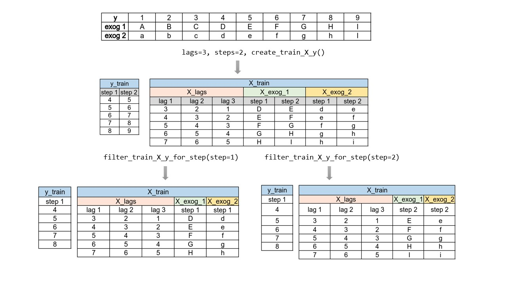
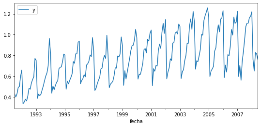

[](https://GitHub.com/Naereen/StrapDown.js/graphs/commit-activity)


[](https://pepy.tech/project/skforecast)


# skforecast

**Time series forecasting with scikit-learn regressors.**

**Skforecast** is a python library that eases using scikit-learn regressors as multi-step forecasters. It also works with any regressor compatible with the scikit-learn API (XGBoost, LightGBM, Ranger...).

<p></p>

## Table of contents

+ [Installation](#installation)
+ [Dependencies](#dependencies)
+ [Features](#features)
+ [Introduction](#introduction)
+ [Examples](#examples)
  + [Autoregressive forecaster](#autoregressive-forecaster)
  + [Autoregressive forecaster with 1 exogenous predictor](#autoregressive-forecaster-with-1-exogenous-predictor)
  + [Autoregressive forecaster with n exogenous predictors](#autoregressive-forecaster-with-n-exogenous-predictors)
  + [Autoregressive forecaster with custom predictors](#autoregressive-forecaster-with-custom-predictors)
  + [Tutorials (spanish)](#tutorials)

## Installation

```bash
$ pip install skforecast
```

```bash
$ pip install git+https://github.com/JoaquinAmatRodrigo/skforecast@v0.1.9
```

Latest (unstable):

```bash
$ pip install git+https://github.com/JoaquinAmatRodrigo/skforecast#master
```

The most common error when importing the library is:

 `'cannot import name 'mean_absolute_percentage_error' from 'sklearn.metrics'`.
 
 This is because the scikit-learn installation is lower than 0.24. Try to upgrade scikit-learn with
 
 `pip install scikit-learn==0.24`

## Dependencies

+ python>=3.7.1
+ numpy>=1.20.1
+ pandas>=1.2.2
+ tqdm>=4.57.0
+ scikit-learn>=0.24


## Features

+ Create recursive autoregressive forecasters from any scikit-learn regressor
+ Create multi-output autoregressive forecasters from any scikit-learn regressor
+ Grid search to find optimal hyperparameters
+ Grid search to find optimal lags (predictors)
+ Include exogenous variables as predictors
+ Include custom predictors (rolling mean, rolling variance ...)
+ Backtesting
+ Prediction interval estimated by bootstrapping
+ Get predictor importance

## TODO

- [ ] Pandas dataframe as input of multiple exogenous variables
- [ ] Parallel grid search
- [ ] Speed lag creation with numba
- [ ] Increase unit test coverage


## Introduction


A time series is a sequence of data arranged chronologically, in principle, equally spaced in time. Time series forecasting is the use of a model to predict future values based on previously observed values, with the option of also including other external variables.

When working with time series, it is seldom needed to predict only the next element in the series (*t+1*). Instead, the most common goal is to predict a whole future interval (*t+1, ..., t+n*)  or a far point in time (*t+n*). There are several strategies that allow generating this type of multiple predictions.
<br>

**Recursive multi-step forecasting**

Since the value of *t(n)* is required to predict the point *t(n-1)*, and *t(n-1)* is unknown, it is necessary to make recursive predictions in which, each new prediction, is based on the previous one. This process is known as recursive forecasting or recursive multi-step forecasting.

<p></p>

<br>

The main challenge when using scikit-learn models for recursive multi-step forecasting is transforming the time series in an matrix where, each value of the series, is related to the time window (lags) that precedes it. This forecasting strategy can be easily generated with the classes `ForecasterAutoreg` and `ForecasterAutoregCustom`.

<p></p>

<center><font size="2.5"> <i>Time series  transformation into a matrix of 5 lags and a vector with the value of the series that follows each row of the matrix.</i></font></center>
<br><br>

**Direct multi-step forecasting**

This strategy consists of training a different model for each step. For example, to predict the next 5 values of a time series, 5 different models are trainded, one for each step. As a result, the predictions are independent of each other. This forecasting strategy can be easily generated with the `ForecasterAutoregMultiOutput` class (changed in version 0.1.9).

<p></p>

<center><font size="2.5"> <i>Time series transformation into the matrices needed to train a direct multi-step forecaster.</i></font></center>
<br><br>

<br><br>

## Examples

### Autoregressive forecaster

```python
# Libraries
# ==============================================================================
import numpy as np
import pandas as pd
import matplotlib.pyplot as plt

from skforecast.ForecasterAutoreg import ForecasterAutoreg
from skforecast.ForecasterAutoregCustom import ForecasterAutoregCustom
from skforecast.model_selection import grid_search_forecaster
from skforecast.model_selection import time_series_spliter
from skforecast.model_selection import cv_forecaster
from skforecast.model_selection import backtesting_forecaster
from skforecast.model_selection import backtesting_forecaster_intervals

from sklearn.linear_model import LinearRegression
from sklearn.ensemble import RandomForestRegressor
from sklearn.metrics import mean_squared_error
```

```python
# Download data
# ==============================================================================
url = ('https://raw.githubusercontent.com/JoaquinAmatRodrigo/skforecast/master/data/h2o.csv')
datos = pd.read_csv(url, sep=',')

# Data preprocessing
# ==============================================================================
datos['fecha'] = pd.to_datetime(datos['fecha'], format='%Y/%m/%d')
datos = datos.set_index('fecha')
datos = datos.rename(columns={'x': 'y'})
datos = datos.asfreq('MS')
datos = datos['y']
datos = datos.sort_index()

# Split train-test
# ==============================================================================
steps = 36
datos_train = datos[:-steps]
datos_test  = datos[-steps:]

# Plot
# ==============================================================================
fig, ax=plt.subplots(figsize=(9, 4))
datos.plot(ax=ax, label='y')
ax.legend();
```

<p>

```python
# Create and fit forecaster
# ==============================================================================
forecaster = ForecasterAutoreg(
                    regressor = LinearRegression(),
                    lags      = 15
                )

forecaster.fit(y=datos_train)
forecaster
```

```
=======================ForecasterAutoreg=======================
Regressor: LinearRegression()
Lags: [ 1  2  3  4  5  6  7  8  9 10 11 12 13 14 15]
Exogenous variable: False
Parameters: {'copy_X': True, 'fit_intercept': True, 'n_jobs': None, 'normalize': False, 'positive': False}
```

```python
# Predict
# ==============================================================================
steps = 36
predictions = forecaster.predict(steps=steps)
# Add datetime index to predictions
predictions = pd.Series(data=predictions, index=datos_test.index)

# Prediction error
# ==============================================================================
error_mse = mean_squared_error(
                y_true = datos_test,
                y_pred = predictions
            )
print(f"Test error (mse): {error_mse}")

# Plot
# ==============================================================================
fig, ax=plt.subplots(figsize=(9, 4))
datos_train.plot(ax=ax, label='train')
datos_test.plot(ax=ax, label='test')
predictions.plot(ax=ax, label='predictions')
ax.legend();
```

```
Test error (mse): 0.011051937043503587
```

<p>

```python
# Grid search hiperparameters and lags
# ==============================================================================
forecaster = ForecasterAutoreg(
                regressor = RandomForestRegressor(random_state=123),
                lags      = 12
             )

# Regressor hiperparameters
param_grid = {'n_estimators': [50, 100],
              'max_depth': [5, 10]}

# Lags used as predictors
lags_grid = [3, 10, [1,2,3,20]]

results_grid = grid_search_forecaster(
                        forecaster  = forecaster,
                        y           = datos_train,
                        param_grid  = param_grid,
                        lags_grid   = lags_grid,
                        steps       = 10,
                        method      = 'cv',
                        metric      = 'mean_squared_error',
                        initial_train_size    = int(len(datos_train)*0.5),
                        allow_incomplete_fold = False,
                        return_best = True,
                        verbose     = False
                    )

results_grid
```

```
loop lags_grid:   0%|          | 0/3 [00:00<?, ?it/s]
loop param_grid:   0%|          | 0/4 [00:00<?, ?it/s]
loop param_grid:  25%|██▌       | 1/4 [00:00<00:02,  1.40it/s]
loop param_grid:  50%|█████     | 2/4 [00:02<00:02,  1.11s/it]
loop param_grid:  75%|███████▌  | 3/4 [00:02<00:00,  1.06it/s]
loop param_grid: 100%|██████████| 4/4 [00:04<00:00,  1.13s/it]
loop lags_grid:  33%|███▎      | 1/3 [00:04<00:08,  4.28s/it] 
loop param_grid:   0%|          | 0/4 [00:00<?, ?it/s]
loop param_grid:  25%|██▌       | 1/4 [00:00<00:02,  1.29it/s]
loop param_grid:  50%|█████     | 2/4 [00:02<00:02,  1.20s/it]
loop param_grid:  75%|███████▌  | 3/4 [00:03<00:01,  1.03s/it]
loop param_grid: 100%|██████████| 4/4 [00:04<00:00,  1.25s/it]
loop lags_grid:  67%|██████▋   | 2/3 [00:08<00:04,  4.52s/it] 
loop param_grid:   0%|          | 0/4 [00:00<?, ?it/s]
loop param_grid:  25%|██▌       | 1/4 [00:00<00:02,  1.38it/s]
loop param_grid:  50%|█████     | 2/4 [00:02<00:02,  1.12s/it]
loop param_grid:  75%|███████▌  | 3/4 [00:02<00:00,  1.06it/s]
loop param_grid: 100%|██████████| 4/4 [00:04<00:00,  1.14s/it]
loop lags_grid: 100%|██████████| 3/3 [00:13<00:00,  4.42s/it] 
2021-02-25 09:51:43,075 root       INFO  Refitting `forecaster` using the best found parameters: 
lags: [ 1  2  3  4  5  6  7  8  9 10] 
params: {'max_depth': 10, 'n_estimators': 50}
```


```
      lags	params	metric
6	[1, 2, 3, 4, 5, 6, 7, 8, 9, 10]	{'max_depth': 10, 'n_estimators': 50}	0.023449
4	[1, 2, 3, 4, 5, 6, 7, 8, 9, 10]	{'max_depth': 5, 'n_estimators': 50}	0.025417
7	[1, 2, 3, 4, 5, 6, 7, 8, 9, 10]	{'max_depth': 10, 'n_estimators': 100}	0.025954
5	[1, 2, 3, 4, 5, 6, 7, 8, 9, 10]	{'max_depth': 5, 'n_estimators': 100}	0.026003
1	[1, 2, 3]	{'max_depth': 5, 'n_estimators': 100}	0.028223
0	[1, 2, 3]	{'max_depth': 5, 'n_estimators': 50}	0.030685
3	[1, 2, 3]	{'max_depth': 10, 'n_estimators': 100}	0.031385
2	[1, 2, 3]	{'max_depth': 10, 'n_estimators': 50}	0.038591
8	[1, 2, 3, 20]	{'max_depth': 5, 'n_estimators': 50}	0.048428
9	[1, 2, 3, 20]	{'max_depth': 5, 'n_estimators': 100}	0.049842
10	[1, 2, 3, 20]	{'max_depth': 10, 'n_estimators': 50}	0.051059
11	[1, 2, 3, 20]	{'max_depth': 10, 'n_estimators': 100}	0.052205
```

```python
# Predictors importance
# ==============================================================================
forecaster.get_feature_importances()
```

```
[0.58116139 0.12777451 0.04191822 0.03095527 0.02517231 0.02482571
 0.04065757 0.01652861 0.02619182 0.08481458]
```

```python
# Prediction intervals
# ==============================================================================
predictions = forecaster.predict_interval(
                    steps    = steps,
                    interval = [5, 95],
                    n_boot   = 1000
              )

# Add datetime index to predictions
predictions = pd.DataFrame(data=predictions, index=datos_test.index)
fig, ax=plt.subplots(figsize=(9, 4))
#datos_train.plot(ax=ax, label='train')
datos_test.plot(ax=ax, label='test')
predictions.iloc[:, 0].plot(ax=ax, label='predictions')
ax.fill_between(predictions.index,
                predictions.iloc[:, 1],
                predictions.iloc[:, 2],
                alpha=0.5)
ax.legend();
```

<p>

```python
# Backtesting
# ==============================================================================
n_test = 36*3 + 1
datos_train = datos[:-n_test]
datos_test  = datos[-n_test:]

steps = 36
regressor = LinearRegression()
forecaster = ForecasterAutoreg(regressor=regressor, lags=15)

metric, predictions_backtest = backtesting_forecaster(
    forecaster = forecaster,
    y          = datos,
    initial_train_size = len(datos_train),
    steps      = steps,
    metric     = 'mean_squared_error',
    verbose    = True
)
print(metric)

# Add datetime index to predictions
predictions_backtest = pd.Series(data=predictions_backtest, index=datos_test.index)
fig, ax = plt.subplots(figsize=(9, 4))
#datos_train.plot(ax=ax, label='train')
datos_test.plot(ax=ax, label='test')
predictions_backtest.plot(ax=ax, label='predictions')
ax.legend();
```

```
Number of observations used for training: 95
Number of folds: 4
Last fold only includes 1 observations.
[0.02150972]
```

<p>


### Autoregressive forecaster with 1 exogenous predictor

```python
# Download data
# ==============================================================================
url = ('https://raw.githubusercontent.com/JoaquinAmatRodrigo/skforecast/master/data/h2o.csv')
datos = pd.read_csv(url, sep=',')

# Data preprocessing
# ==============================================================================
datos['fecha'] = pd.to_datetime(datos['fecha'], format='%Y/%m/%d')
datos = datos.set_index('fecha')
datos = datos.rename(columns={'x': 'y'})
datos = datos.asfreq('MS')
datos = datos['y']
datos = datos.sort_index()

# Exogenous variable
# ==============================================================================
datos_exog = datos.rolling(window=10, closed='right').mean() + 0.5
datos_exog = datos_exog[10:]
datos = datos[10:]

# Plot
# ==============================================================================
fig, ax=plt.subplots(figsize=(9, 4))
datos.plot(ax=ax, label='y')
datos_exog.plot(ax=ax, label='exogenous variable')
ax.legend();
```

<p>

```python
# Split train-test
# ==============================================================================
steps = 36
datos_train = datos[:-steps]
datos_test  = datos[-steps:]

datos_exog_train = datos_exog[:-steps]
datos_exog_test  = datos_exog[-steps:]
```

```python
# Create and fit forecaster
# ==============================================================================
forecaster = ForecasterAutoreg(
                    regressor = LinearRegression(),
                    lags      = 8
             )

forecaster.fit(y=datos_train, exog=datos_exog_train)

# Predict
# ==============================================================================
steps = 36
predictions = forecaster.predict(steps=steps, exog=datos_exog_test)
# Add datetime index to predictions
predictions = pd.Series(data=predictions, index=datos_test.index)

# Error prediction
# ==============================================================================
error_mse = mean_squared_error(
                y_true = datos_test,
                y_pred = predictions
            )
print(f"Test error (mse): {error_mse}")

# Plot
# ==============================================================================
fig, ax=plt.subplots(figsize=(9, 4))
datos_train.plot(ax=ax, label='train')
datos_test.plot(ax=ax, label='test')
predictions.plot(ax=ax, label='predictions')
ax.legend();
```

```
Test error (mse): 0.020306077140235308
```

<p>


```python
# Grid search hiperparameters and lags
# ==============================================================================
forecaster = ForecasterAutoreg(
                regressor=RandomForestRegressor(random_state=123),
                lags=12
             )

# Regressor hiperparameters
param_grid = {'n_estimators': [50, 100],
              'max_depth': [5, 10]}

# Lags used as predictors
lags_grid = [3, 10, [1,2,3,20]]

results_grid = grid_search_forecaster(
                        forecaster  = forecaster,
                        y           = datos_train,
                        exog        = datos_exog_train,
                        param_grid  = param_grid,
                        lags_grid   = lags_grid,
                        steps       = 10,
                        method      = 'cv',
                        metric      = 'mean_squared_error',
                        initial_train_size    = int(len(datos_train)*0.5),
                        allow_incomplete_fold = False,
                        return_best = True,
                        verbose     = False
                )

# Results grid Search
# ==============================================================================
results_grid
```

### Autoregressive forecaster with n exogenous predictors
<br>

```python
# Download data
# ==============================================================================
url = ('https://raw.githubusercontent.com/JoaquinAmatRodrigo/skforecast/master/data/h2o.csv')
datos = pd.read_csv(url, sep=',')

# Data preprocessing
# ==============================================================================
datos['fecha'] = pd.to_datetime(datos['fecha'], format='%Y/%m/%d')
datos = datos.set_index('fecha')
datos = datos.rename(columns={'x': 'y'})
datos = datos.asfreq('MS')
datos = datos['y']
datos = datos.sort_index()

# Exogenous variables
# ==============================================================================
datos_exog_1 = datos.rolling(window=10, closed='right').mean() + 0.5
datos_exog_2 = datos.rolling(window=10, closed='right').mean() + 1
datos_exog_1 = datos_exog_1[10:]
datos_exog_2 = datos_exog_2[10:]
datos = datos[10:]

# Plot
# ==============================================================================
fig, ax=plt.subplots(figsize=(9, 4))
datos.plot(ax=ax, label='y')
datos_exog_1.plot(ax=ax, label='exogenous 1')
datos_exog_2.plot(ax=ax, label='exogenous 2')
ax.legend();
```

<p>

```python
# Split train-test
# ==============================================================================
steps = 36
datos_train = datos[:-steps]
datos_test  = datos[-steps:]

datos_exog = np.column_stack((datos_exog_1.values, datos_exog_2.values))
datos_exog_train = datos_exog[:-steps,]
datos_exog_test  = datos_exog[-steps:,]
```

```python
# Create and fit forecaster
# ==============================================================================
forecaster = ForecasterAutoreg(
                    regressor = LinearRegression(),
                    lags      = 8
             )

forecaster.fit(y=datos_train, exog=datos_exog_train)

# Predict
# ==============================================================================
steps = 36
predictions = forecaster.predict(steps=steps, exog=datos_exog_test)
# Add datetime index
predictions = pd.Series(data=predictions, index=datos_test.index)

# Error
# ==============================================================================
error_mse = mean_squared_error(
                y_true = datos_test,
                y_pred = predictions
            )
print(f"Test error (mse): {error_mse}")

# Plot
# ==============================================================================
fig, ax=plt.subplots(figsize=(9, 4))
datos_train.plot(ax=ax, label='train')
datos_test.plot(ax=ax, label='test')
predictions.plot(ax=ax, label='predictions')
ax.legend();
```

```
Test error (mse): 0.020306077140235298
```

<p>
  
  
### Autoregressive forecaster with custom predictors

```python
# Download data
# ==============================================================================
url = ('https://raw.githubusercontent.com/JoaquinAmatRodrigo/skforecast/master/data/h2o.csv')
datos = pd.read_csv(url, sep=',')

# Data preprocessing
# ==============================================================================
datos['fecha'] = pd.to_datetime(datos['fecha'], format='%Y/%m/%d')
datos = datos.set_index('fecha')
datos = datos.rename(columns={'x': 'y'})
datos = datos.asfreq('MS')
datos = datos['y']
datos = datos.sort_index()

# Split train-test
# ==============================================================================
steps = 36
datos_train = datos[:-steps]
datos_test  = datos[-steps:]
```

```python
# Custom function to create poredictors
# ==============================================================================
def create_predictors(y):
    '''
    Create first 10 lags of a time series.
    Calculate moving average with window 20.
    '''
    
    X_train = pd.DataFrame({'y':y.copy()})
    for i in range(0, 10):
        X_train[f'lag_{i+1}'] = X_train['y'].shift(i)
        
    X_train['moving_avg'] = X_train['y'].rolling(20).mean()
    
    X_train = X_train.drop(columns='y').tail(1).to_numpy()  
    
    return X_train  
```

```python
# Create and fit forecaster
# ==============================================================================
forecaster = ForecasterAutoregCustom(
                    regressor      = RandomForestRegressor(random_state=123),
                    fun_predictors = create_predictors,
                    window_size    = 20
                )

forecaster.fit(y=datos_train)
```

```python
# Grid search hiperparameters
# ==============================================================================
forecaster = ForecasterAutoregCustom(
                    regressor      = RandomForestRegressor(random_state=123),
                    fun_predictors = create_predictors,
                    window_size    = 20
                )

# Regressor hiperparameters
param_grid = {'n_estimators': [50, 100],
              'max_depth': [5, 10]}


results_grid = grid_search_forecaster(
                        forecaster  = forecaster,
                        y           = datos_train,
                        param_grid  = param_grid,
                        steps       = 36,
                        metric      = 'mean_squared_error',
                        method      = 'cv',
                        initial_train_size    = int(len(datos_train)*0.5),
                        allow_incomplete_fold = False,
                        return_best = True,
                        verbose     = False
                    )
```

## Tutorials 
**(spanish)**

+ [Forecasting series temporales con Python y Scikit Learn](https://www.cienciadedatos.net/documentos/py27-forecasting-series-temporales-python-scikitlearn.html)

+ [Predicción (forecasting) de la demanda eléctrica con Python](https://www.cienciadedatos.net/documentos/py29-forecasting-demanda-energia-electrica-python.html)


## References

+ Hyndman, R.J., & Athanasopoulos, G. (2018) Forecasting: principles and practice, 2nd edition, OTexts: Melbourne, Australia

+ Time Series Analysis and Forecasting with ADAM Ivan Svetunkov

+ Python for Finance: Mastering Data-Driven Finance


## Licence

**joaquinAmatRodrigo/skforecast** is licensed under the **MIT License**, a short and simple permissive license with conditions only requiring preservation of copyright and license notices. Licensed works, modifications, and larger works may be distributed under different terms and without source code.
