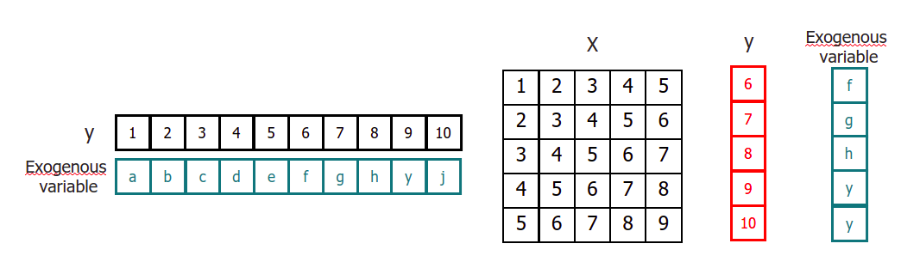

# Recursive multi-step forecasting with exogenous variables

`ForecasterAutoreg` and `ForecasterAutoregCustom` allow to include exogenous variables as predictors as long as their future values are known, since they must be included during the predict process.

When using exogenous variables in recursive multi-step forecasting, their values should be aligned so that y[i] is regressed on exog[i].




## Libraries

``` python
# Libraries
# ==============================================================================
import numpy as np
import pandas as pd
import matplotlib.pyplot as plt

from skforecast.ForecasterAutoreg import ForecasterAutoreg
from sklearn.linear_model import Ridge
from sklearn.metrics import mean_squared_error
```

## Data

``` python
# Download data
# ==============================================================================
url = ('https://raw.githubusercontent.com/JoaquinAmatRodrigo/skforecast/master/data/h2o_exog.csv')
data = pd.read_csv(url, sep=',', header=0, names=['datetime', 'y', 'exog_1', 'exog_2'])

# Data preprocessing
# ==============================================================================
data['datetime'] = pd.to_datetime(data['datetime'], format='%Y/%m/%d')
data = data.set_index('datetime')
data = data.asfreq('MS')
data = data.sort_index()

# Plot
# ==============================================================================
fig, ax=plt.subplots(figsize=(9, 4))
data.plot(ax=ax);
```


``` python
# Split train-test
# ==============================================================================
steps = 36
data_train = data.iloc[:-steps, :]
data_test  = data.iloc[-steps:, :]
```

## Create and train forecaster


``` python
# Create and fit forecaster
# ==============================================================================
forecaster = ForecasterAutoreg(
                    regressor = Ridge(),
                    lags      = 15
                )

forecaster.fit(
    y    = data_train['y'],
    exog = data_train[['exog_1', 'exog_2']].values
)

forecaster
```

```
=======================ForecasterAutoreg=======================
Regressor: Ridge()
Lags: [ 1  2  3  4  5  6  7  8  9 10 11 12 13 14 15]
Exogenous variable: True
Parameters: {'alpha': 1.0, 'copy_X': True, 'fit_intercept': True, 'max_iter': None, 'normalize': False, 'random_state': None, 'solver': 'auto', 'tol': 0.001}
```

## Prediction

If the `Forecaster` has been trained with exogenous variables, they shlud be provided when predictiong.


``` python
# Predict
# ==============================================================================
steps = 36
predictions = forecaster.predict(
                steps = steps,
                exog = data_test[['exog_1', 'exog_2']].values
               )
# Add datetime index to predictions
predictions = pd.Series(data=predictions, index=data_test.index)
predictions.head(3)
```

```
fecha
2005-07-01    0.965051
2005-08-01    1.014752
2005-09-01    1.140090
Freq: MS, dtype: float64
```

``` python
# Plot predictions
# ==============================================================================
fig, ax=plt.subplots(figsize=(9, 4))
data_train['y'].plot(ax=ax, label='train')
data_test['y'].plot(ax=ax, label='test')
predictions.plot(ax=ax, label='predictions')
ax.legend();
```


``` python
# Prediction error
# ==============================================================================
error_mse = mean_squared_error(
                y_true = data_test['y'],
                y_pred = predictions
            )
print(f"Test error (mse): {error_mse}")
```

```
Test error (mse): 0.008474661390588431
```

## Feature importance

``` python
# When using as regressor LinearRegression, Ridge or Lasso
forecaster.get_coef()

# When using as regressor RandomForestRegressor or GradientBoostingRegressor
# forecaster.get_feature_importances()
```

```
array([ 0.1173852 ,  0.0290203 ,  0.02626445, -0.06322356, -0.04009523,
       -0.00921489, -0.04732691, -0.00662549,  0.01139862,  0.01485692,
        0.15042588,  0.56962708,  0.01581026, -0.08791199, -0.06785373,
        0.09607342,  0.21051962])
```

## Extract training matrix

``` python
X, y = forecaster.create_train_X_y(
            y    = data_train['y'],
            exog = data_train[['exog_1', 'exog_2']].values
       )
```