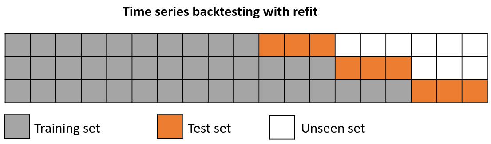
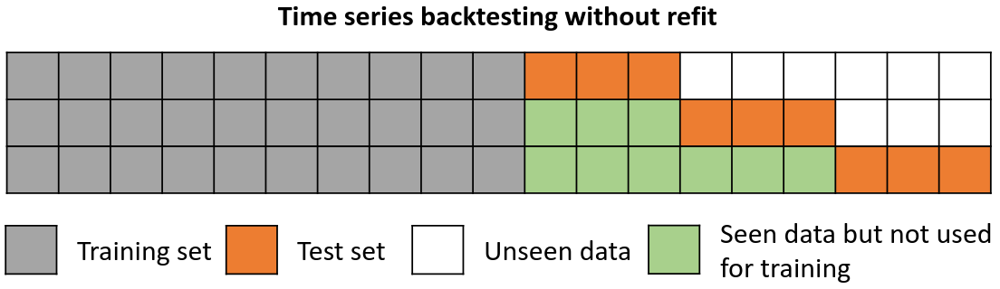

# Backtesting

**Backtesting with refit**

The model is trained each time before making the predictions, in this way, the model use all the information available so far. It is a variation of the standard cross-validation but, instead of making a random distribution of the observations, the training set is increased sequentially, maintaining the temporal order of the data.



<br>

**Backtesting without refit**

After an initial train, the model is used sequentially without updating it and following the temporal order of the data. This strategy has the advantage of being much faster since the model is only trained once. However, the model does not incorporate the latest information available so it may lose predictive capacity over time.




## Libraries

``` python
import numpy as np
import pandas as pd
import matplotlib.pyplot as plt

from skforecast.ForecasterAutoreg import ForecasterAutoreg
from skforecast.model_selection import backtesting_forecaster
from sklearn.linear_model import Ridge
from sklearn.metrics import mean_squared_error
```

## Data

``` python
# Download data
# ==============================================================================
url = ('https://raw.githubusercontent.com/JoaquinAmatRodrigo/skforecast/master/data/h2o.csv')
data = pd.read_csv(url, sep=',')

# Data preprocessing
# ==============================================================================
data['fecha'] = pd.to_datetime(data['fecha'], format='%Y/%m/%d')
data = data.set_index('fecha')
data = data.rename(columns={'x': 'y'})
data = data.asfreq('MS')
data = data['y']
data = data.sort_index()

# Plot
# ==============================================================================
fig, ax=plt.subplots(figsize=(9, 4))
data.plot(ax=ax)
ax.legend()
```


## Backtest

``` python
# Backtest forecaster
# ==============================================================================
n_backtest = 36*3  # Last 9 years are used for backtest
data_train = data[:-n_backtest]
data_test  = data[-n_backtest:]

forecaster = ForecasterAutoreg(
                regressor = RandomForestRegressor(random_state=123),
                lags      = 15 
             )

metric, predictions_backtest = backtesting_forecaster(
                                    forecaster = forecaster,
                                    y          = data,
                                    initial_train_size = len(data_train),
                                    steps      = 10,
                                    metric     = 'mean_squared_error',
                                    refit      = True,
                                    verbose    = True
                               )
```

<pre>
Information of backtesting process
----------------------------------
Number of observations used for initial training: 96
Number of observations used for backtesting: 108
    Number of folds: 11
    Number of steps per fold: 10
    Last fold only includes 8 observations.

Data partition in fold: 0
    Training:   1991-07-01 00:00:00 -- 1999-06-01 00:00:00
    Validation: 1999-07-01 00:00:00 -- 2000-04-01 00:00:00
Data partition in fold: 1
    Training:   1991-07-01 00:00:00 -- 2000-04-01 00:00:00
    Validation: 2000-05-01 00:00:00 -- 2001-02-01 00:00:00
Data partition in fold: 2
    Training:   1991-07-01 00:00:00 -- 2001-02-01 00:00:00
    Validation: 2001-03-01 00:00:00 -- 2001-12-01 00:00:00
Data partition in fold: 3
    Training:   1991-07-01 00:00:00 -- 2001-12-01 00:00:00
    Validation: 2002-01-01 00:00:00 -- 2002-10-01 00:00:00
Data partition in fold: 4
    Training:   1991-07-01 00:00:00 -- 2002-10-01 00:00:00
    Validation: 2002-11-01 00:00:00 -- 2003-08-01 00:00:00
Data partition in fold: 5
    Training:   1991-07-01 00:00:00 -- 2003-08-01 00:00:00
    Validation: 2003-09-01 00:00:00 -- 2004-06-01 00:00:00
Data partition in fold: 6
    Training:   1991-07-01 00:00:00 -- 2004-06-01 00:00:00
    Validation: 2004-07-01 00:00:00 -- 2005-04-01 00:00:00
Data partition in fold: 7
    Training:   1991-07-01 00:00:00 -- 2005-04-01 00:00:00
    Validation: 2005-05-01 00:00:00 -- 2006-02-01 00:00:00
Data partition in fold: 8
    Training:   1991-07-01 00:00:00 -- 2006-02-01 00:00:00
    Validation: 2006-03-01 00:00:00 -- 2006-12-01 00:00:00
Data partition in fold: 9
    Training:   1991-07-01 00:00:00 -- 2006-12-01 00:00:00
    Validation: 2007-01-01 00:00:00 -- 2007-10-01 00:00:00
Data partition in fold: 10
    Training:   1991-07-01 00:00:00 -- 2007-10-01 00:00:00
    Validation: 2007-11-01 00:00:00 -- 2008-06-01 00:00:00
</pre>

``` python
print(f"Error de backtest: {metric}")
```

<pre>
Error de backtest: [0.00726621]
</pre>

``` python
predictions_backtest.head(4)
```

|                     |     pred |
|:--------------------|---------:|
| 1999-07-01 00:00:00 | 0.712336 |
| 1999-08-01 00:00:00 | 0.750542 |
| 1999-09-01 00:00:00 | 0.802371 |
| 1999-10-01 00:00:00 | 0.806941 | 

``` python
# Plot backtest predictions
# ==============================================================================
fig, ax = plt.subplots(figsize=(9, 4))
data_test.plot(ax=ax, label='test')
predictions_backtest.plot(ax=ax, label='predictions')
ax.legend()
```


## Backtest with prediction intervals

``` python
# Backtest forecaster
# ==============================================================================
n_backtest = 36*3
data_train = data[:-n_backtest]
data_test  = data[-n_backtest:]

forecaster = ForecasterAutoreg(
                regressor = Ridge(),
                lags      = 15 
             )

metric, predictions_backtest = backtesting_forecaster(
                                    forecaster = forecaster,
                                    y          = data,
                                    initial_train_size = len(data_train),
                                    steps      = 10,
                                    metric     = 'mean_squared_error',
                                    refit      = True,
                                    interval   = [5, 95],
                                    n_boot     = 500,
                                    verbose    = True
                               )

```

<pre>
Information of backtesting process
----------------------------------
Number of observations used for initial training: 96
Number of observations used for backtesting: 108
    Number of folds: 11
    Number of steps per fold: 10
    Last fold only includes 8 observations.

Data partition in fold: 0
    Training:   1991-07-01 00:00:00 -- 1999-06-01 00:00:00
    Validation: 1999-07-01 00:00:00 -- 2000-04-01 00:00:00
Data partition in fold: 1
    Training:   1991-07-01 00:00:00 -- 2000-04-01 00:00:00
    Validation: 2000-05-01 00:00:00 -- 2001-02-01 00:00:00
Data partition in fold: 2
    Training:   1991-07-01 00:00:00 -- 2001-02-01 00:00:00
    Validation: 2001-03-01 00:00:00 -- 2001-12-01 00:00:00
Data partition in fold: 3
    Training:   1991-07-01 00:00:00 -- 2001-12-01 00:00:00
    Validation: 2002-01-01 00:00:00 -- 2002-10-01 00:00:00
Data partition in fold: 4
    Training:   1991-07-01 00:00:00 -- 2002-10-01 00:00:00
    Validation: 2002-11-01 00:00:00 -- 2003-08-01 00:00:00
Data partition in fold: 5
    Training:   1991-07-01 00:00:00 -- 2003-08-01 00:00:00
    Validation: 2003-09-01 00:00:00 -- 2004-06-01 00:00:00
Data partition in fold: 6
    Training:   1991-07-01 00:00:00 -- 2004-06-01 00:00:00
    Validation: 2004-07-01 00:00:00 -- 2005-04-01 00:00:00
Data partition in fold: 7
    Training:   1991-07-01 00:00:00 -- 2005-04-01 00:00:00
    Validation: 2005-05-01 00:00:00 -- 2006-02-01 00:00:00
Data partition in fold: 8
    Training:   1991-07-01 00:00:00 -- 2006-02-01 00:00:00
    Validation: 2006-03-01 00:00:00 -- 2006-12-01 00:00:00
Data partition in fold: 9
    Training:   1991-07-01 00:00:00 -- 2006-12-01 00:00:00
    Validation: 2007-01-01 00:00:00 -- 2007-10-01 00:00:00
Data partition in fold: 10
    Training:   1991-07-01 00:00:00 -- 2007-10-01 00:00:00
    Validation: 2007-11-01 00:00:00 -- 2008-06-01 00:00:00
</pre>

``` python
# Plot backtest predictions
# ==============================================================================
fig, ax=plt.subplots(figsize=(9, 4))
data_test.plot(ax=ax, label='test')
predictions_backtest.iloc[:, 0].plot(ax=ax, label='predictions')
ax.fill_between(
    predictions_backtest.index,
    predictions_backtest.iloc[:, 1],
    predictions_backtest.iloc[:, 2],
    color = 'red',
    alpha = 0.2,
    label = 'prediction interval'
)
ax.legend();
```


