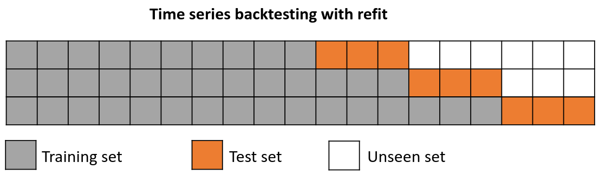

# Backtesting

**Backtesting with refit**

The model is trained each time before making the predictions, in this way, the model use all the information available so far. It is a variation of the standard cross-validation but, instead of making a random distribution of the observations, the training set is increased sequentially, maintaining the temporal order of the data.

**Backtesting with refit and fixed train size**

A technique similar to backtesting with refit but, in this case, the training set doesn't increase sequentially. This is also known as time series cross validation or walk-forward validation.

**Backtesting without refit**

After an initial train, the model is used sequentially without updating it and following the temporal order of the data. This strategy has the advantage of being much faster since the model is only trained once. However, the model does not incorporate the latest information available so it may lose predictive capacity over time.

