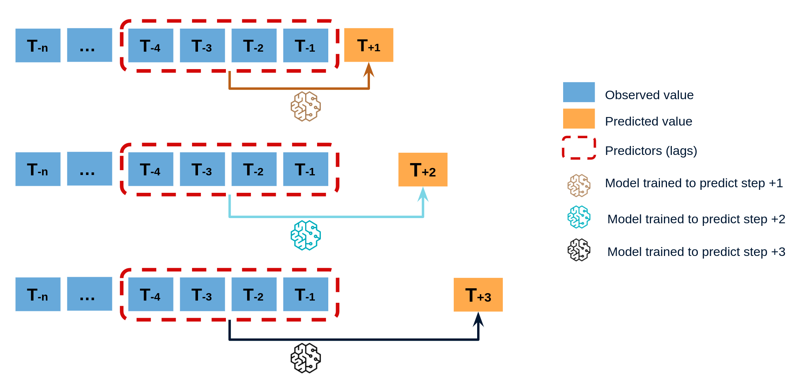

# Introduction to forecasting

## Time series and forecasting

A time series is a sequence of data arranged chronologically, in principle, equally spaced in time. Forecasting is the process of predicting future values of a time series based on its previously observed patterns (autoregressive), or including external variables.

## Machine learning for forecasting

In order to apply machine learning models to forecasting problems, the time series has to be transformed into a matrix in which each value is related to the time window (lags) that precedes it. In a time series context, a lag with respect to a time step *t* is defined as the values of the series at previous time steps. For example, lag 1 is the value at time step *t−1* and lag *m* is the value at time step *t−m*.

 <i>Time series transformation into a matrix of 5 lags and a vector with the value of the series that follows each row of the matrix.</i>

This type of transformation also allows to include additional variables.

 <i>Time series transformation including an exogenous variable.</i>

Once data have been rearranged into the new shape, any regression model can be trained to predict the next value (step) of the series. During model training, every row is considered a separate data instance, where values at lags 1, 2, ... *p* are considered predictors for the target quantity of the time series at time step *p+1*. 

## Single-step forecasting

Single-step prediction is used when the goal is to predict only the next value of the series.

## Multi-step forecasting

When working with time series, it is seldom needed to predict only the next element in the series (*t+1*). Instead, the most common goal is to predict a whole future interval (*t+1, ..., t+n*)  or a far point in time (*t+n*). Several strategies allow generating this type of prediction.

### Recursive multi-step forecasting

Since the value *t(n-1)* is required to predict *t(n)*, and *t(n-1)* is unknown, a recursive process is applied in which, each new prediction, is based on the previous one. This process is known as recursive forecasting or recursive multi-step forecasting and can be easily generated with the `ForecasterAutoreg` and `ForecasterAutoregCustom` classes.

### Direct multi-step forecasting

Direct multi-step forecasting consists of training a different model for each step of the forecast horizon. For example, to predict the next 5 values of a time series, 5 different models are trained, one for each step. As a result, the predictions are independent of each other. This entire process is automated in the `ForecasterAutoregDirect` class. 

### Multiple output forecasting

Some machine learning models, such as long short-term memory (LSTM) neural network, can predict simultaneously several values of a sequence (*one-shot*). This strategy is not currently implemented in skforecast library.

## Backtesting forecasting models

Backtesting is a term used in modeling to refer to testing a predictive model on historical data. Backtesting involves moving backward in time, step-by-step, in as many stages as is necessary. Therefore, it is a special type of cross-validation applied to previous period(s).

### Backtesting with refit and increasing training size (fixed origin)

The model is trained each time before making predictions. With this configuration, the model uses all the data available so far. It is a variation of the standard cross-validation but, instead of making a random distribution of the observations, the training set increases sequentially, maintaining the temporal order of the data.

### Backtesting with refit and fixed training size (rolling origin)

A technique similar to the previous one but, in this case, the forecast origin rolls forward, therefore, the size of training remains constant. This is also known as time series cross-validation or walk-forward validation.

### Backtesting without refit

After an initial train, the model is used sequentially without updating it and following the temporal order of the data. This strategy has the advantage of being much faster since the model is trained only once. However, the model does not incorporate the latest information available, so it may lose predictive capacity over time.

