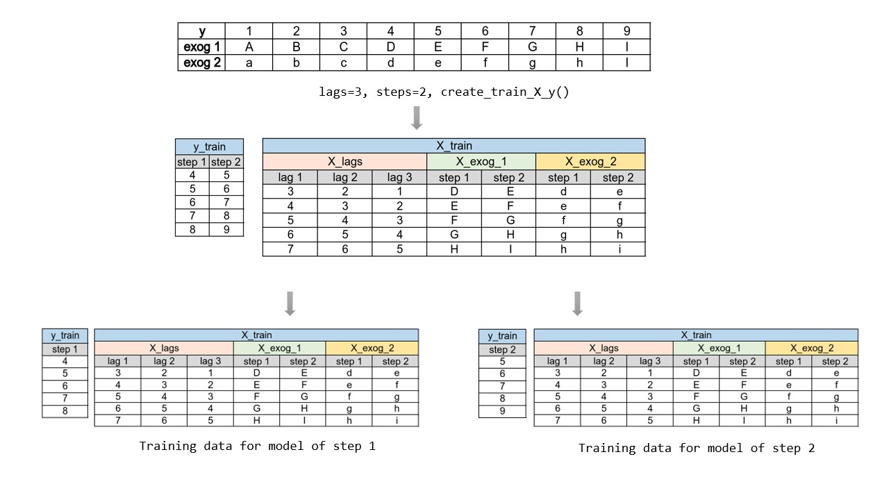

In the deprecated version of `ForecasterAutoregMultiOutput`, the data matrices used to train each model share the information of exogenous variables for all steps. Althougt this is not including future information (exogenous variables are known in advance), the number of predictors increase rapidly.

 <i>Deprecated strategy of transformation needed to train a direct multi-step forecaster.</i>

  

  

Istead, the current strategy include for each model only the exogenous values associated with the current step.

 <i>Current strategy of transformation needed to train a direct multi-step forecaster.</i>

  

  
